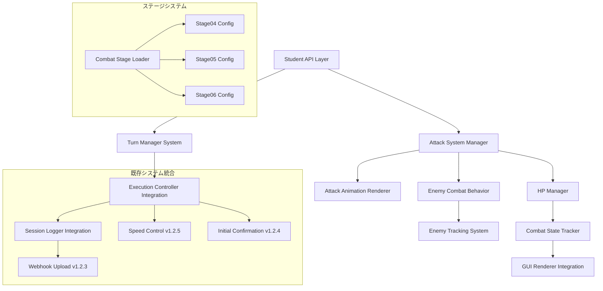
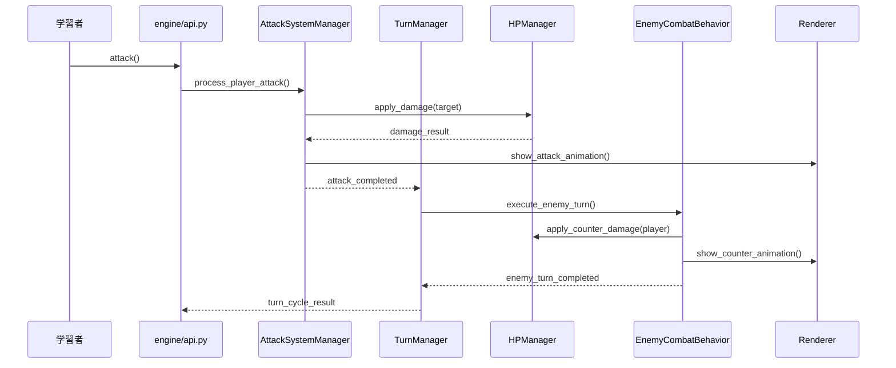
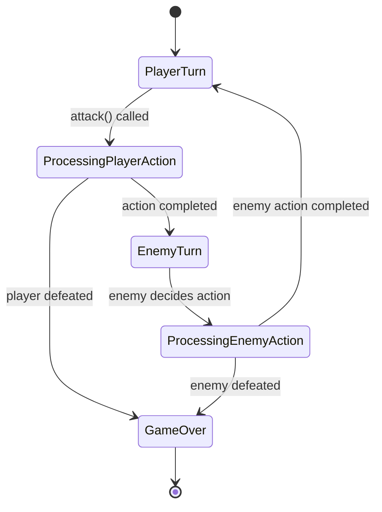
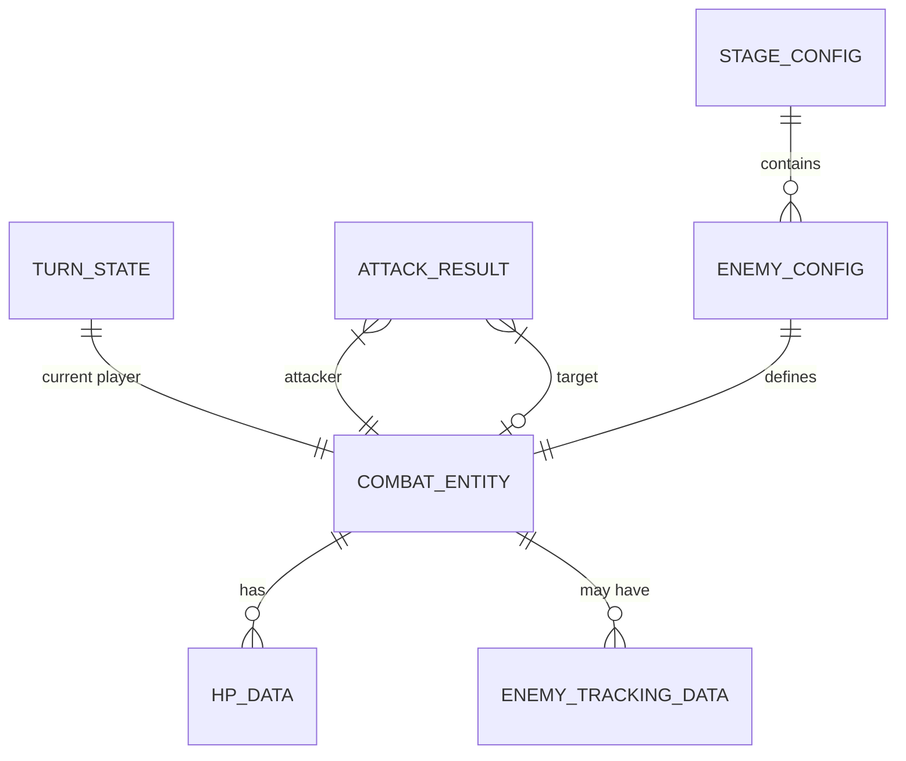

# 技術設計書

## 概要

v1.2.6では、Python初学者向けローグライク演習フレームワークに包括的な攻撃システムを統合します。この設計は研究に基づいたターン制戦闘システム、HP/ダメージ管理、敵AIカウンター攻撃機能を実装し、既存のv1.2.5システム（速度制御、セッションログ、実行制御）との完全な互換性を維持します。

## 要件マッピング

### 設計コンポーネント追跡可能性
各設計コンポーネントは特定の要件に対応：
- **AttackSystemManager** → 1.1-1.5: キャラクター攻撃API・バリデーション・GUI統合
- **EnemyCombatBehavior** → 2.1-2.5: カウンター攻撃ロジック・AI調整システム
- **EnemyTrackingSystem** → 3.1-3.5: 敵方向管理・監視状態・追跡メカニズム
- **TurnManagerSystem** → 9.1-9.5: ターン制実行調整・プレイヤー敵交互実行
- **HPManager** → 7.1-7.5: HP追跡・ダメージ適用・ゲームオーバー判定
- **CombatStageLoader** → 4.1, 5.1, 6.1: ステージ固有の敵・HP設定
- **CombatExecutionController** → 8.1-8.5: 既存システム統合・速度制御・ログ記録

### ユーザーストーリーカバレッジ
- **初学者の攻撃学習**: AttackSystemManagerとAttackCommandが条件分岐概念を教育
- **因果関係理解**: EnemyCombatBehaviorが攻撃→反撃の流れを提供
- **戦略的思考育成**: EnemyTrackingSystemが複雑な条件分岐の必要性を示す
- **ループ構造学習**: Stage05の繰り返し攻撃でループ概念を体験
- **順次実行理解**: TurnManagerSystemでターン制の概念を学習

## アーキテクチャ



### 技術スタック
研究結果と要件分析に基づく：

- **コア言語**: Python 3.8+ (既存システム継続)
- **ゲームエンジン**: pygame 2.5.0+ (GUI描画・イベント処理)
- **状態管理**: 有限状態機械 (Turn States, Combat States)
- **設計パターン**: Command Pattern (攻撃アクション), Observer Pattern (GUI更新), Strategy Pattern (敵AI行動)
- **データ形式**: YAML (ステージ設定), JSON (セッションログ)
- **テストフレームワーク**: pytest 7.4.0+ (マーカー、モック、統合テスト)

### アーキテクチャ決定根拠
研究に基づく主要技術選択の理由：

- **Command Patternの継続使用**: 既存のmove(), turn_left(), turn_right()と一貫性を保ち、attack()も同様のコマンドとして実装。undo/replay機能とExecutionControllerとの統合が容易。
- **State Machine for Turn Management**: ターン制ゲームの標準的なアプローチ。PlayerTurn/EnemyTurnの明確な状態遷移により、ターン実行の教育的価値を最大化。
- **Observer Pattern for HP Updates**: HP変更時のGUI更新、ゲームオーバー判定、アニメーション再生を疎結合で実現。既存のrenderer.pyとの統合が自然。
- **Component-Based HP System**: Entity-Component-Systemのアプローチを部分採用。HPを独立したコンポーネントとして管理し、キャラクターと敵で共通の処理を実現。

### データフロー図

#### 主要ユーザーフロー
攻撃アクション実行の詳細シーケンス：



#### ターン制戦闘フロー


## コンポーネント・インターフェース

### バックエンドサービス・メソッドシグネチャ

#### AttackSystemManager
```python
class AttackSystemManager:
    def __init__(self, hp_manager: HPManager, turn_manager: TurnManager):
        """攻撃システムの中央管理クラス"""
    
    def process_player_attack(self, direction: Direction) -> AttackResult:
        """プレイヤーの攻撃処理・ダメージ計算・対象検証"""
    
    def validate_attack_target(self, attacker_pos: Position, direction: Direction) -> Optional[Entity]:
        """攻撃対象の存在確認・有効性検証"""
    
    def execute_attack_animation(self, attacker: Entity, target: Entity) -> None:
        """攻撃アニメーションの実行・GUI連携"""
```

#### HPManager
```python
class HPManager:
    def __init__(self):
        """HP管理システム・エンティティ状態追跡"""
    
    def set_initial_hp(self, entity: Entity, hp: int) -> None:
        """ゲーム開始時HP設定・ステージ設定統合"""
    
    def apply_damage(self, target: Entity, damage: int) -> DamageResult:
        """ダメージ適用・撃破判定・状態更新"""
    
    def get_hp(self, entity: Entity) -> int:
        """現在HP取得・GUI表示用"""
    
    def is_defeated(self, entity: Entity) -> bool:
        """撃破状態確認・ゲームオーバー判定"""
```

#### TurnManager
```python
class TurnManager:
    def __init__(self, execution_controller: ExecutionController):
        """ターン管理システム・実行制御統合"""
    
    def execute_player_turn(self, action: Command) -> TurnResult:
        """プレイヤーターン実行・アクションカウント・次ターン準備"""
    
    def execute_enemy_turn(self, enemy: Entity) -> TurnResult:
        """敵ターン実行・AI行動決定・ターン切り替え"""
    
    def get_current_turn_state(self) -> TurnState:
        """現在のターン状況取得・GUI表示用"""
```

#### EnemyCombatBehavior
```python
class EnemyCombatBehavior:
    def __init__(self, tracking_system: EnemyTrackingSystem):
        """敵戦闘行動システム・追跡システム統合"""
    
    def process_counter_attack(self, enemy: Entity, player: Entity) -> AttackResult:
        """カウンター攻撃処理・方向調整・ダメージ適用"""
    
    def calculate_required_turns(self, enemy: Entity, player_pos: Position) -> int:
        """方向転換必要ターン数計算・側面/背面攻撃対応"""
    
    def update_enemy_orientation(self, enemy: Entity, target_pos: Position) -> None:
        """敵の向き更新・追跡状態管理"""
```

### 学生向けAPI拡張 (engine/api.py)

```python
def attack() -> bool:
    """
    キャラクターが向いている方向の1マス先を攻撃
    
    Returns:
        bool: 攻撃が敵に命中したかどうか
        
    Note:
        攻撃の成否に関わらずアクションカウントが1増加
        ターンが敵に移行
    """
```

### GUIコンポーネント統合

| コンポーネント | 責任範囲 | 統合ポイント |
|---------------|----------|-------------|
| AttackAnimationRenderer | 攻撃・カウンター攻撃の視覚表現 | renderer.py拡張 |
| HPDisplayManager | HP値のリアルタイム表示 | GUIレンダラー統合 |
| CombatFeedbackRenderer | ダメージ数値・撃破通知表示 | 教育フィードバック統合 |
| TurnIndicatorRenderer | 現在のターン表示 | GUI状況表示エリア |

## データモデル

### ドメインエンティティ
1. **CombatEntity**: 戦闘に参加するキャラクター・敵の基底クラス
2. **HPData**: HP関連データの管理構造
3. **AttackResult**: 攻撃結果の詳細情報
4. **TurnState**: ターン制実行の状態管理
5. **EnemyTrackingData**: 敵の追跡・監視状態データ

### エンティティ関係図


### データモデル定義

```python
from dataclasses import dataclass
from enum import Enum
from typing import Optional
import datetime

class PlayerType(Enum):
    PLAYER = "player"
    ENEMY = "enemy"

class CombatState(Enum):
    ALIVE = "alive"
    DEFEATED = "defeated"

@dataclass
class HPData:
    current_hp: int
    max_hp: int
    state: CombatState = CombatState.ALIVE
    
    @property
    def is_defeated(self) -> bool:
        return self.current_hp <= 0 or self.state == CombatState.DEFEATED

@dataclass
class AttackResult:
    success: bool
    damage_dealt: int
    target_defeated: bool
    animation_type: str
    message: str = ""  # 教育的フィードバック用

@dataclass
class TurnState:
    current_player: PlayerType
    turn_number: int
    action_count: int
    game_active: bool = True

@dataclass
class EnemyTrackingData:
    is_engaged: bool = False
    target_position: Optional[tuple] = None
    turns_to_orient: int = 0
    last_attacked_turn: int = 0
    monitoring_active: bool = False

@dataclass
class DamageResult:
    damage_applied: int
    hp_remaining: int
    target_defeated: bool
    overkill_damage: int = 0

@dataclass
class CombatStageConfig:
    stage_id: str
    player_start_hp: int
    enemy_configs: list['EnemyConfig']
    damage_per_attack: int = 1
    player_start_position: tuple = (0, 0)
    goal_position: tuple = (4, 4)

@dataclass
class EnemyConfig:
    hp: int
    position: tuple
    behavior_type: str = "counter_attack"
    damage: int = 1
```

### ステージ設定データ構造 (YAML)

```yaml
# stage04.yml - 1回攻撃撃破ステージ
id: stage04
name: "基本攻撃演習"
board:
  size: {w: 5, h: 5}
  repr:
    grid: |
      P....
      .....
      ..E..
      .....
      ....G
combat:
  player_hp: 3
  enemies:
    - position: [2, 2] 
      hp: 1
      damage: 1
      behavior: "counter_attack"
api:
  allowed: [turn_left, turn_right, move, attack]
educational:
  guidance: "attack()関数を使用して敵を撃破し、ゴールに向かいましょう。"
  concepts: ["条件分岐", "攻撃アクション", "ターン制バトル"]
```

## 既存システムとの統合

### ExecutionController統合
```python
class CombatExecutionController:
    def __init__(self, base_controller: ExecutionController, turn_manager: TurnManager):
        """既存実行制御システムとターン管理の統合"""
    
    def execute_step_with_combat(self, action: Command) -> ExecutionResult:
        """ステップ実行時の戦闘ターン処理"""
    
    def apply_speed_control_to_combat(self, speed_multiplier: float) -> None:
        """v1.2.5速度制御の戦闘システム適用"""
```

### SessionLogger統合
```python
class CombatSessionLogger:
    def log_attack_action(self, result: AttackResult) -> None:
        """攻撃アクションのセッションログ記録"""
    
    def log_combat_session_data(self) -> dict:
        """戦闘セッション終了時の追加データ"""
        return {
            "attacks_made": self.attack_count,
            "damage_dealt": self.total_damage_dealt,
            "damage_received": self.total_damage_received,
            "enemies_defeated": self.enemies_defeated_count,
            "turns_survived": self.turns_survived
        }
```

## エラーハンドリング

### 攻撃システム専用例外
```python
class AttackSystemError(Exception):
    """攻撃システム基底例外"""
    pass

class InvalidAttackTargetError(AttackSystemError):
    """無効な攻撃対象エラー"""
    pass

class TurnOrderViolationError(AttackSystemError):
    """ターン順序違反エラー"""
    pass

class HPSystemError(AttackSystemError):
    """HP管理システムエラー"""
    pass
```

### 教育的エラーメッセージ
- 攻撃失敗時: "敵が見つかりません。turn_left()やturn_right()で向きを調整してから攻撃してみましょう。"
- HP不足時: "キャラクターのHPが0になりました。敵の攻撃パターンを分析してより効率的な戦略を考えてみましょう。"
- ターン違反時: "現在は敵のターンです。プレイヤーのアクションは次のターンで実行されます。"

## パフォーマンス・スケーラビリティ

### パフォーマンス目標
| メトリック | 目標値 | 測定方法 |
|-----------|--------|----------|
| 攻撃処理応答時間 | < 50ms | アクション実行計測 |
| ターン切り替え時間 | < 30ms | 状態遷移計測 |
| HP更新・GUI反映 | < 20ms | 表示更新計測 |
| 敵AI判断時間 | < 100ms | AI処理計測 |
| メモリ使用量増加 | < 10MB | 戦闘システム追加分 |

### 最適化戦略
- **オブジェクトプール**: AttackResultオブジェクトの再利用
- **状態キャッシング**: 敵の方向計算結果キャッシュ
- **遅延評価**: GUI更新の必要時のみ実行
- **イベント最適化**: 不要なGUI更新イベント削減

## テスト戦略

### リスクマトリックス
| 領域 | リスク | 必須テスト | オプション | 参照 |
|-----|------|-----------|-----------|------|
| 攻撃システム | M | Unit, Integration | Performance | 1.1-1.5 |
| ターン管理 | H | Unit, Integration, E2E | Load | 9.1-9.5 |
| HP管理 | H | Unit, Property | Integration | 7.1-7.5 |
| 敵AI | M | Unit, Integration | Behavior | 2.1-2.5, 3.1-3.5 |
| 既存統合 | H | Integration, E2E | Regression | 8.1-8.5 |
| 教育価値 | M | E2E | Usability | 4.1-6.5 |

### レイヤー別最小テスト
- **Unit**: 攻撃計算、HP管理、ダメージ適用、ターン状態遷移
- **Integration**: 戦闘システム統合、既存システム連携、ステージ読み込み
- **E2E**: Stage04-06完全フロー、学習者体験シナリオ

### CIゲート
| ステージ | 実行テスト | ゲート | SLA |
|---------|------------|-------|-----|
| PR | Unit + Contract | 失敗=ブロック | ≤3分 |
| Staging | Integration + E2E | 失敗=ブロック | ≤5分 |
| Nightly | Performance + Load | 回帰→課題作成 | - |

### テストファイル構成
```
tests/
├── test_attack_system.py           # 攻撃システム単体テスト
├── test_hp_manager.py              # HP管理単体テスト  
├── test_turn_manager.py            # ターン管理単体テスト
├── test_enemy_combat_behavior.py   # 敵AI戦闘行動テスト
├── test_combat_integration.py      # 戦闘システム統合テスト
├── test_stage04_combat.py          # Stage04 E2Eテスト
├── test_stage05_combat.py          # Stage05 E2Eテスト
├── test_stage06_combat.py          # Stage06 E2Eテスト
├── test_combat_execution_controller.py # 実行制御統合テスト
└── test_combat_session_logging.py  # セッションログ統合テスト
```

### 品質保証基準
- **テスト成功率**: 88.9%以上の維持
- **カバレッジ**: 新規コードの90%以上
- **パフォーマンス**: 上記パフォーマンス目標の達成
- **教育的価値**: 学習シナリオの完全実行確認