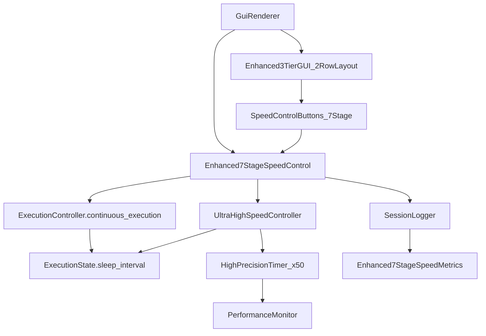
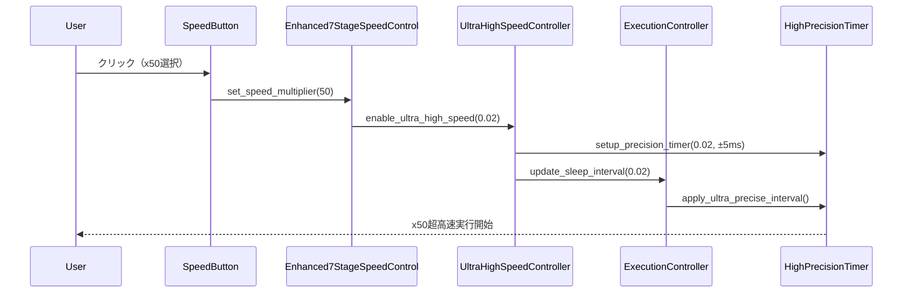
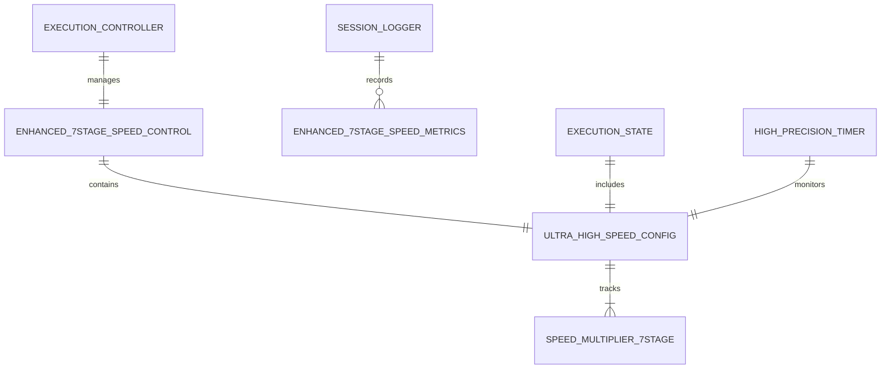

# Technical Design

## Overview

v1.2.5では、Continue実行速度制御機能を既存のExecutionControllerシステムに統合し、学習者の個人ペースに応じた7段階速度調整（x1〜x50倍速）を実現します。現在の1秒固定スリープから、x1（1.0秒）からx50（0.02秒）までの幅広い動的速度制御を可能にし、Execution Controlパネルを3段構成に拡張します。x10/x50の超高速実行は目視確認がほぼ不要な大量ステップの自動実行を想定し、最小限の変更で最大限の機能拡張を実現します。

## Requirements Mapping

### Design Component Traceability
各設計コンポーネントは特定の要件に対応：
- **Enhanced7StageSpeedControl** → 1.1-1.9: 7段階速度制御システムEARS要件
- **Enhanced3TierGUI** → 2.1-2.6: 3段構成パネル拡張（2行ボタンレイアウト）EARS要件  
- **UltraHighSpeedController** → 3.1-3.4: リアルタイム速度変更（x50対応）EARS要件
- **ExecutionControllerIntegration** → 4.1-4.5: 既存システム統合EARS要件
- **HighPrecisionPerformanceMonitor** → 5.1-5.5: 超高速精度保証（±5ms）EARS要件

### User Story Coverage
- **学習者の幅広い速度ニーズ**: Enhanced7StageSpeedControlによるx1〜x50の包括的速度制御
- **直感的UI操作**: Enhanced3TierGUIによる整理された3段構成レイアウト（2行ボタン配置）
- **超高速自動実行**: UltraHighSpeedControllerによる大量ステップ処理（x10/x50）
- **実行中の動的調整**: 継続実行中の速度変更（全7段階対応）
- **システム整合性**: ExecutionControllerIntegrationによる既存機能との完全統合
- **高精度保証**: HighPrecisionPerformanceMonitorによる超高速動作の安定性

## Architecture



### Technology Stack
既存技術スタックとの完全互換性を維持しつつ高精度対応：

- **GUI Framework**: pygame 2.5.0+ (7ボタン2行レイアウト拡張)
- **Execution Control**: ExecutionController (7段階速度拡張)
- **High Precision Timing**: time.perf_counter() (x50=0.02秒精度対応)
- **Event Handling**: EventProcessingEngine (7段階イベント処理)
- **State Management**: ExecutionState dataclass (7段階速度状態)
- **Logging**: SessionLogger (7段階速度メトリクス)
- **Testing**: pytest 7.4.0+ (超高速実行テスト対応)

### Architecture Decision Rationale
- **なぜ7段階拡張**: x10/x50の超高速実行で大量ステップの効率的処理を実現
- **なぜ2行ボタンレイアウト**: 7ボタンの視認性と操作性を確保
- **なぜ高精度タイマー**: x50（0.02秒）での±5ms精度要件に対応
- **なぜUltraHighSpeedController**: 超高速実行特有の制御ロジックを分離し安定性向上

### Data Flow

#### Primary 7-Stage Speed Control Flow
7段階速度制御データフロー：



## Components and Interfaces

### Backend Services & Method Signatures

#### Enhanced7StageSpeedControlManager (新規)
```python
class Enhanced7StageSpeedControlManager:
    def __init__(self, execution_controller: ExecutionController):
        """7段階速度制御管理の初期化"""
    
    def set_speed_multiplier(self, multiplier: int) -> bool:
        """速度倍率設定 (1,2,3,4,5,10,50)"""
    
    def get_current_speed_multiplier(self) -> int:
        """現在の速度倍率取得"""
    
    def calculate_sleep_interval(self, multiplier: int) -> float:
        """倍率から実際のスリープ時間算出"""
    
    def is_ultra_high_speed(self, multiplier: int) -> bool:
        """超高速モード判定 (x10, x50)"""
    
    def apply_speed_change_realtime(self, multiplier: int) -> bool:
        """実行中のリアルタイム速度変更（7段階対応）"""
    
    def reset_to_default_speed(self) -> None:
        """デフォルト速度（x1）にリセット"""
    
    def validate_speed_multiplier(self, multiplier: int) -> bool:
        """速度倍率の妥当性検証（7段階）"""
```

#### UltraHighSpeedController (新規)
```python
class UltraHighSpeedController:
    def __init__(self, speed_control_manager):
        """超高速制御専用コンポーネント"""
    
    def enable_ultra_high_speed_mode(self, target_interval: float) -> bool:
        """超高速モード有効化 (x10=0.1s, x50=0.02s)"""
    
    def setup_precision_timer(self, interval: float, tolerance_ms: float) -> None:
        """高精度タイマー設定"""
    
    def monitor_ultra_speed_stability(self) -> dict:
        """超高速実行の安定性監視"""
    
    def handle_ultra_speed_degradation(self) -> bool:
        """超高速性能低下時の自動対処"""
```

#### Enhanced ExecutionController (拡張)
```python
class ExecutionController:  # 既存クラス拡張
    def update_sleep_interval_realtime(self, new_interval: float) -> bool:
        """実行中のスリープ間隔リアルタイム更新（7段階対応）"""
    
    def get_7stage_speed_metrics_for_logging(self) -> dict:
        """セッションログ用7段階速度メトリクス取得"""
    
    def sync_speed_with_state_7stage(self) -> None:
        """ExecutionStateと7段階速度設定の同期"""
    
    def handle_ultra_high_speed_execution(self, interval: float) -> bool:
        """超高速実行専用処理（x10, x50）"""
```

#### Enhanced GuiRenderer (拡張)
```python
class GuiRenderer:  # 既存クラス拡張
    def _draw_enhanced_3tier_control_panel(self) -> None:
        """3段構成拡張コントロールパネル描画（2行ボタンレイアウト）"""
    
    def _draw_7stage_speed_control_buttons(self) -> List[pygame.Rect]:
        """7段階速度制御ボタン群描画（2行配置）"""
    
    def _handle_7stage_speed_button_click(self, button_id: str) -> bool:
        """7段階速度ボタンクリック処理 (x1-x50)"""
    
    def _update_7stage_speed_visual_indicator(self) -> None:
        """現在速度の視覚的表示更新（7段階対応）"""
    
    def _render_ultra_speed_warning(self) -> None:
        """超高速実行時の注意表示 (x10, x50)"""
```

### Frontend Components

| Component | Responsibility | Props/State Summary |
|-----------|---------------|-------------------|
| Enhanced3TierControlPanel_7Stage | 3段階レイアウト管理（7ボタン対応） | panel_height: int, current_speed: int |
| SpeedControlButtonGrid_2Row | x1-x50ボタン2行描画・管理 | selected_speed: int, button_grid: 2x4 |
| UltraSpeedVisualIndicator | 超高速表示（x10/x50専用） | current_multiplier: int, is_ultra_speed: bool |
| SpeedPrecisionMonitor | 速度精度表示 | precision_ms: float, target_interval: float |
| ExecutionControlButtons | 既存Step/Continue/Pause/Stop | existing_state: ExecutionMode |

### API Endpoints
内部API（GUI→Backend）インターフェース:

| Method | Interface | Purpose | Error Handling |
|--------|-----------|---------|---------------|
| POST | Enhanced7StageSpeedControl.set_speed_multiplier() | 7段階速度倍率設定 | ValueError, RuntimeError |
| GET | Enhanced7StageSpeedControl.get_current_speed_multiplier() | 現在速度取得 | なし |
| POST | UltraHighSpeedController.enable_ultra_high_speed_mode() | 超高速モード制御 | UltraSpeedError |
| POST | ExecutionController.update_sleep_interval_realtime() | リアルタイム更新 | ExecutionError |
| GET | ExecutionController.get_7stage_speed_metrics_for_logging() | ログ用メトリクス | なし |

## Data Models

### Domain Entities
1. **Enhanced7StageSpeedMultiplier**: 速度倍率設定（1,2,3,4,5,10,50の7段階）
2. **UltraHighSpeedConfiguration**: 超高速設定の管理状態
3. **Enhanced7StageSpeedMetrics**: セッションログ用7段階速度メトリクス
4. **HighPrecisionTimingData**: 超高速精度データ
5. **Enhanced ExecutionState**: 拡張実行状態（7段階速度情報含む）

### Entity Relationships


### Data Model Definitions

```python
@dataclass
class UltraHighSpeedConfiguration:
    current_multiplier: int = 1  # x1,x2,x3,x4,x5,x10,x50
    sleep_interval: float = 1.0  # 実際のスリープ時間
    is_ultra_high_speed: bool = False  # x10, x50フラグ
    precision_tolerance_ms: float = 5.0  # 精度許容値
    last_changed: datetime = field(default_factory=datetime.now)
    is_realtime_change: bool = False
    
    def __post_init__(self):
        """バリデーション"""
        valid_multipliers = [1, 2, 3, 4, 5, 10, 50]
        if self.current_multiplier not in valid_multipliers:
            raise ValueError(f"速度倍率は{valid_multipliers}のいずれかである必要があります")
        if self.sleep_interval < 0.01:
            raise ValueError("スリープ間隔は0.01秒以上である必要があります")
        self.is_ultra_high_speed = self.current_multiplier in [10, 50]

@dataclass  
class Enhanced7StageSpeedMetrics:
    session_id: str
    speed_changes: List[Tuple[datetime, int]]  # (変更時刻, 倍率)
    total_execution_time_by_speed: Dict[int, float]  # {倍率: 実行時間}
    ultra_high_speed_usage: Dict[int, float]  # {10: 時間, 50: 時間}
    average_speed_multiplier: float
    max_speed_used: int
    ultra_speed_precision_stats: Dict[str, float]  # 精度統計
    realtime_changes_count: int
    
@dataclass
class HighPrecisionTimingData:
    target_interval: float  # 目標間隔
    actual_intervals: List[float]  # 実測値
    precision_deviation_ms: List[float]  # 精度偏差
    stability_coefficient: float  # 安定性係数
    
@dataclass
class EnhancedExecutionState(ExecutionState):  # 既存クラス拡張
    ultra_speed_config: UltraHighSpeedConfiguration = field(default_factory=UltraHighSpeedConfiguration)
    precision_timing_data: HighPrecisionTimingData = field(default_factory=HighPrecisionTimingData)
    speed_change_history: List[Enhanced7StageSpeedMetrics] = field(default_factory=list)
```

### 7-Stage Speed Multiplier Mapping
```python
# 7段階速度倍率とスリープ間隔のマッピング
ENHANCED_7STAGE_SPEED_MAPPING = {
    1: 1.0,     # x1 (1秒) - 標準速度
    2: 0.5,     # x2 (0.5秒) - 2倍速
    3: 0.33,    # x3 (0.33秒) - 3倍速
    4: 0.25,    # x4 (0.25秒) - 4倍速
    5: 0.2,     # x5 (0.2秒) - 5倍速
    10: 0.1,    # x10 (0.1秒) - 超高速
    50: 0.02    # x50 (0.02秒) - 最高速度
}

# 超高速モード判定
ULTRA_HIGH_SPEED_MULTIPLIERS = [10, 50]
ULTRA_HIGH_SPEED_PRECISION_TOLERANCE = {
    10: 10.0,  # x10: ±10ms
    50: 5.0    # x50: ±5ms
}
```

## Error Handling

### 7段階速度制御エラー管理
```python
class Enhanced7StageSpeedControlError(Exception):
    """7段階速度制御関連エラー基底クラス"""

class InvalidSpeedMultiplierError(Enhanced7StageSpeedControlError):
    """無効な速度倍率エラー（7段階検証）"""

class UltraHighSpeedError(Enhanced7StageSpeedControlError):
    """超高速実行エラー (x10, x50)"""

class HighPrecisionTimingError(Enhanced7StageSpeedControlError):
    """高精度タイミングエラー"""

class RealTimeSpeedChangeError(Enhanced7StageSpeedControlError):
    """リアルタイム速度変更エラー（7段階）"""

class ExecutionSyncError(Enhanced7StageSpeedControlError):
    """実行同期エラー"""
```

### エラー処理戦略
- **無効速度設定**: デフォルト速度（x1）に自動復旧
- **超高速実行失敗**: 安全速度（x5）に自動降格、ユーザーに通知
- **精度要件未達成**: x50→x10への自動降格、精度監視継続
- **リアルタイム変更失敗**: 現在速度維持、エラーログ記録
- **実行同期エラー**: ExecutionController状態を安全に復旧

## Security Considerations

- **入力検証**: 速度倍率の厳密な7段階範囲チェック（1,2,3,4,5,10,50）
- **超高速制御**: x10/x50での安全性確保、自動降格メカニズム
- **状態整合性**: ExecutionStateとUltraHighSpeedConfigurationの同期保証
- **リソース制限**: 最大100アクション実行での高精度タイミング維持
- **エラー時安全性**: 異常時の自動デフォルト復旧、超高速モード無効化

## Performance & Scalability

### Performance Targets
| Metric | Target | Measurement |
|--------|--------|-------------|
| 速度変更応答時間 | < 50ms | GUI button→ExecutionController |
| タイミング精度 (x50) | ±5ms | 0.02秒間隔の維持精度 |
| タイミング精度 (x10) | ±10ms | 0.1秒間隔の維持精度 |
| メモリ使用量追加 | < 15MB | 7段階SpeedControl+UI拡張 |
| 長期実行安定性 | 100アクション | 超高速タイミングドリフト < ±2% |
| 超高速切替時間 | < 20ms | x1→x50速度切替遅延 |

### Memory Management
- **UltraHighSpeedConfiguration**: 軽量な設定オブジェクト（< 2KB）
- **Enhanced7StageSpeedMetrics履歴**: 最大150エントリでローテーション
- **GUI要素**: 2行7ボタンレイアウト追加（最小メモリ増加）
- **高精度タイマー**: 専用メモリプール使用（< 5MB）
- **イベントハンドラー**: 既存EventProcessingEngine拡張活用

### Ultra-High-Speed Precision Strategy
```python
# 超高精度タイミング制御（x50専用）
def ultra_precise_sleep(self, target_interval: float, tolerance_ms: float) -> None:
    """超高精度スリープ実装（x50=0.02秒 ±5ms）"""
    start_time = time.perf_counter()
    target_end = start_time + target_interval
    tolerance_sec = tolerance_ms / 1000.0
    
    # 粗いスリープフェーズ（95%まで）
    rough_end = target_end - (target_interval * 0.05)
    while time.perf_counter() < rough_end:
        time.sleep(0.001)  # 1ms粗いスリープ
    
    # 精密スピンロックフェーズ（残り5%）
    while time.perf_counter() < target_end - tolerance_sec:
        pass  # CPU集約的な高精度待機
    
    # 最終調整フェーズ
    while time.perf_counter() < target_end:
        pass

def monitor_precision_deviation(self) -> float:
    """精度偏差監視"""
    deviations = []
    for actual, target in zip(self.actual_intervals, self.target_intervals):
        deviation_ms = abs(actual - target) * 1000
        deviations.append(deviation_ms)
    
    avg_deviation = sum(deviations) / len(deviations)
    return avg_deviation
```

### 2-Row Button Layout Strategy
```python
# 7ボタン2行レイアウト最適化
def optimize_2row_button_layout(self) -> dict:
    """2行7ボタンの最適レイアウト"""
    return {
        'row1': ['x1', 'x2', 'x3', 'x4'],  # 標準速度
        'row2': ['x5', 'x10', 'x50'],      # 高速・超高速
        'button_size': (45, 25),           # 小型化
        'row_spacing': 5,                  # 行間隔
        'visual_grouping': {
            'standard': ['x1', 'x2', 'x3', 'x4', 'x5'],
            'ultra_high': ['x10', 'x50']   # 色分け表示
        }
    }
```

## Testing Strategy

### Risk Matrix
| Area | Risk | Must | Optional | Ref |
|---|---|---|---|---|
| Ultra-High Speed Precision | H | Unit, Integration, Performance | Stress | 5.2 |
| 7-Stage Speed Transitions | H | Integration, E2E | Load | 1.1-1.9 |
| 2-Row UI Responsiveness | M | Unit, GUI | Usability | 2.4 |
| Real-time Speed Change (7-stage) | H | Integration, E2E | Stress | 3.1-3.4 |
| Execution Sync (7-stage) | H | Unit, Contract | Integration | 4.5 |
| Memory Footprint (7-stage) | M | Performance | Load | 5.1 |

### Minimal by Layer
- **Unit**: Enhanced7StageSpeedControlManager, UltraHighSpeedConfiguration validation, 7段階timing calculations
- **Integration**: ExecutionController→7StageSpeedControl→UltraHighSpeed→GUI同期テスト
- **GUI**: 3段構成パネル描画、2行7ボタンレイアウト、超高速視覚フィードバック
- **E2E**: ユーザー7段階速度変更→実行速度反映の完全フロー（x1→x50→x10→x1）

### Test Categories & Files
```python
# tests/test_enhanced_7stage_speed_control_manager.py
class TestEnhanced7StageSpeedControlManager:
    def test_7stage_speed_multiplier_validation(self):
        """7段階速度倍率の妥当性検証テスト"""
    
    def test_sleep_interval_calculation_7stage(self):
        """7段階スリープ間隔計算精度テスト"""
    
    def test_ultra_high_speed_detection(self):
        """超高速モード判定テスト (x10, x50)"""
    
    def test_realtime_7stage_speed_change(self):
        """リアルタイム7段階速度変更テスト"""

# tests/test_ultra_high_speed_controller.py
class TestUltraHighSpeedController:
    def test_x50_precision_timing(self):
        """x50(0.02秒)精度テスト ±5ms以内"""
    
    def test_x10_precision_timing(self):
        """x10(0.1秒)精度テスト ±10ms以内"""
    
    def test_ultra_speed_stability_monitoring(self):
        """超高速安定性監視テスト"""
    
    def test_performance_degradation_handling(self):
        """性能低下時の自動対処テスト"""

# tests/test_enhanced_gui_renderer_7stage.py  
class TestEnhanced7StageGUI:
    def test_3tier_panel_2row_layout(self):
        """3段構成2行レイアウトテスト"""
    
    def test_7stage_speed_button_interaction(self):
        """7段階速度ボタン相互作用テスト"""
    
    def test_ultra_speed_visual_indicator(self):
        """超高速表示精度テスト"""
    
    def test_2row_button_layout_optimization(self):
        """2行ボタンレイアウト最適化テスト"""

# tests/test_execution_controller_7stage_integration.py
class TestExecutionController7StageIntegration:
    def test_7stage_continuous_execution(self):
        """7段階速度制御付き連続実行テスト"""
    
    def test_ultra_high_speed_execution_integration(self):
        """超高速実行統合テスト (x10, x50)"""
    
    def test_7stage_speed_change_during_execution(self):
        """実行中7段階速度変更テスト"""
    
    def test_reset_7stage_speed_integration(self):
        """リセット時7段階速度設定統合テスト"""
```

### CI Gates
| Stage | Run | Gate | SLA |
|---|---|---|---|
| PR | Unit + 2Row GUI | Fail = block | ≤3m |
| Integration | ExecutionController + 7Stage Speed | Fail = block | ≤5m |
| Performance | Ultra-high precision (x50) | Regression → issue | ≤8m |

### Ultra-High-Speed Performance Validation
```python
def test_x50_ultra_high_speed_precision():
    """x50速度(0.02秒)の超高精度検証"""
    speed_manager = Enhanced7StageSpeedControlManager(controller)
    ultra_controller = UltraHighSpeedController(speed_manager)
    
    speed_manager.set_speed_multiplier(50)
    ultra_controller.enable_ultra_high_speed_mode(0.02)
    
    timings = []
    for _ in range(20):  # より多くのサンプル
        start = time.perf_counter()
        controller.wait_for_action()  # 0.02秒待機
        elapsed = time.perf_counter() - start
        timings.append(elapsed)
    
    avg_timing = sum(timings) / len(timings)
    assert 0.015 <= avg_timing <= 0.025, f"精度要件外: {avg_timing}秒"
    
    # ±5ms精度チェック
    for timing in timings:
        deviation_ms = abs(timing - 0.02) * 1000
        assert deviation_ms <= 5.0, f"精度要件外: {deviation_ms}ms"
    
    # 安定性チェック（標準偏差）
    import statistics
    std_dev_ms = statistics.stdev(timings) * 1000
    assert std_dev_ms < 3.0, f"安定性要件外: σ={std_dev_ms}ms"

def test_7stage_speed_transition_performance():
    """7段階速度切替パフォーマンステスト"""
    speed_manager = Enhanced7StageSpeedControlManager(controller)
    
    test_sequence = [1, 50, 10, 5, 2, 3, 4]  # 全7段階切替
    
    for multiplier in test_sequence:
        start = time.perf_counter()
        result = speed_manager.set_speed_multiplier(multiplier)
        transition_time = (time.perf_counter() - start) * 1000
        
        assert result == True, f"速度切替失敗: x{multiplier}"
        assert transition_time <= 20.0, f"切替時間要件外: {transition_time}ms"
        
        # 実際の速度反映確認
        actual_interval = ENHANCED_7STAGE_SPEED_MAPPING[multiplier]
        assert speed_manager.execution_controller.state.sleep_interval == actual_interval
```

### Exit Criteria
- **Sev1/Sev2エラー**: 0件
- **超高速精度**: x50速度で±5ms以内、x10速度で±10ms以内維持
- **UI応答性**: 7段階速度ボタンクリック→反映20ms以内
- **メモリ使用量**: 追加15MB以下
- **切替性能**: 全7段階間の速度切替20ms以内
- **既存機能**: 全既存ExecutionController機能の完全互換性
- **統合テスト**: 全7段階速度（x1,x2,x3,x4,x5,x10,x50）での連続実行成功率100%
- **長期安定性**: x50で100アクション連続実行、精度劣化±2%以内