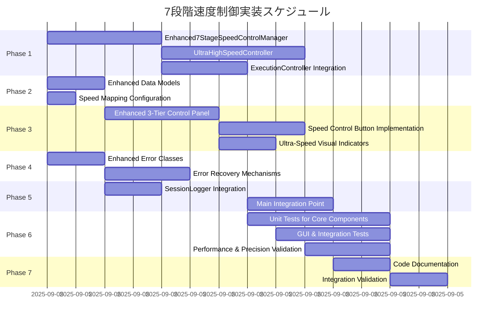

# Implementation Tasks

## Overview
continue-execution-speed-control-v1.2.5の実装タスク計画。7段階速度制御（x1, x2, x3, x4, x5, x10, x50）の実現により、学習者の個人ペースに応じた包括的な実行速度調整機能を提供します。既存のExecutionControllerシステムとの完全統合により、最小限の変更で最大限の機能拡張を実現します。

## Task Breakdown

### Phase 1: Core Backend Implementation

#### Task 1.1: Enhanced7StageSpeedControlManager Implementation
**Priority:** High | **Estimated Time:** 4 hours | **Dependencies:** None

**Description:**
7段階速度制御の中核となるEnhanced7StageSpeedControlManagerクラスを実装します。

**Deliverables:**
- [ ] `engine/enhanced_7stage_speed_control_manager.py` 新規作成
- [ ] 7段階速度倍率設定機能 (1, 2, 3, 4, 5, 10, 50)
- [ ] スリープ間隔計算機能（ENHANCED_7STAGE_SPEED_MAPPING使用）
- [ ] 超高速モード判定機能（x10, x50）
- [ ] リアルタイム速度変更機能
- [ ] バリデーション機能（7段階範囲チェック）

**Implementation Details:**
```python
class Enhanced7StageSpeedControlManager:
    def __init__(self, execution_controller: ExecutionController)
    def set_speed_multiplier(self, multiplier: int) -> bool
    def get_current_speed_multiplier(self) -> int
    def calculate_sleep_interval(self, multiplier: int) -> float
    def is_ultra_high_speed(self, multiplier: int) -> bool
    def apply_speed_change_realtime(self, multiplier: int) -> bool
    def reset_to_default_speed(self) -> None
    def validate_speed_multiplier(self, multiplier: int) -> bool
```

**Acceptance Criteria:**
- 全7段階速度倍率（1,2,3,4,5,10,50）の正確な設定・取得
- スリープ間隔計算の精度（x50=0.02秒、x10=0.1秒等）
- 超高速モード判定の正確性（x10, x50のみTrue）
- 無効値に対する適切なエラーハンドリング

#### Task 1.2: UltraHighSpeedController Implementation  
**Priority:** High | **Estimated Time:** 5 hours | **Dependencies:** Task 1.1

**Description:**
超高速実行（x10, x50）専用の制御システムを実装します。高精度タイミング制御と安定性監視機能を提供します。

**Deliverables:**
- [ ] `engine/ultra_high_speed_controller.py` 新規作成
- [ ] 超高精度タイマー実装（±5ms for x50, ±10ms for x10）
- [ ] 超高速安定性監視機能
- [ ] 性能低下時の自動対処機能
- [ ] 精度偏差計算・統計機能

**Implementation Details:**
```python
class UltraHighSpeedController:
    def __init__(self, speed_control_manager)
    def enable_ultra_high_speed_mode(self, target_interval: float) -> bool
    def setup_precision_timer(self, interval: float, tolerance_ms: float) -> None
    def monitor_ultra_speed_stability(self) -> dict
    def handle_ultra_speed_degradation(self) -> bool
    def ultra_precise_sleep(self, target_interval: float, tolerance_ms: float) -> None
    def monitor_precision_deviation(self) -> float
```

**Acceptance Criteria:**
- x50速度で±5ms精度維持
- x10速度で±10ms精度維持  
- 連続100アクション実行での安定性
- 精度劣化時の自動降格機能

#### Task 1.3: ExecutionController Integration
**Priority:** High | **Estimated Time:** 3 hours | **Dependencies:** Task 1.1, 1.2

**Description:**
既存ExecutionControllerクラスを7段階速度制御に対応するよう拡張します。

**Deliverables:**
- [ ] `engine/execution_controller.py` 既存ファイル拡張
- [ ] リアルタイムスリープ間隔更新機能
- [ ] 7段階速度メトリクス取得機能
- [ ] ExecutionStateとの同期機能
- [ ] 超高速実行専用処理機能

**Implementation Details:**
```python
class ExecutionController:  # 既存クラス拡張
    def update_sleep_interval_realtime(self, new_interval: float) -> bool
    def get_7stage_speed_metrics_for_logging(self) -> dict
    def sync_speed_with_state_7stage(self) -> None
    def handle_ultra_high_speed_execution(self, interval: float) -> bool
```

**Acceptance Criteria:**
- 既存continuous_execution()メソッドとの完全互換性
- リアルタイム速度変更時の正確な反映
- ExecutionStateの一貫性維持

### Phase 2: Data Models & Configuration

#### Task 2.1: Enhanced Data Models Implementation
**Priority:** Medium | **Estimated Time:** 2 hours | **Dependencies:** None

**Description:**
7段階速度制御に必要な新しいデータモデルを実装します。

**Deliverables:**
- [ ] `engine/__init__.py` 既存ファイル拡張
- [ ] UltraHighSpeedConfiguration dataclass
- [ ] Enhanced7StageSpeedMetrics dataclass
- [ ] HighPrecisionTimingData dataclass
- [ ] EnhancedExecutionState dataclass（既存拡張）

**Implementation Details:**
```python
@dataclass
class UltraHighSpeedConfiguration:
    current_multiplier: int = 1
    sleep_interval: float = 1.0
    is_ultra_high_speed: bool = False
    precision_tolerance_ms: float = 5.0
    last_changed: datetime
    is_realtime_change: bool = False

@dataclass  
class Enhanced7StageSpeedMetrics:
    session_id: str
    speed_changes: List[Tuple[datetime, int]]
    total_execution_time_by_speed: Dict[int, float]
    ultra_high_speed_usage: Dict[int, float]
    average_speed_multiplier: float
    max_speed_used: int
    ultra_speed_precision_stats: Dict[str, float]
    realtime_changes_count: int
```

**Acceptance Criteria:**
- 全データクラスの適切なバリデーション
- 既存ExecutionStateとの整合性
- シリアライゼーション対応

#### Task 2.2: Speed Mapping Configuration
**Priority:** Low | **Estimated Time:** 1 hour | **Dependencies:** None

**Description:**
7段階速度倍率とスリープ間隔のマッピング定数を定義します。

**Deliverables:**
- [ ] `engine/speed_constants.py` 新規作成または `engine/__init__.py` 拡張
- [ ] ENHANCED_7STAGE_SPEED_MAPPING定数
- [ ] ULTRA_HIGH_SPEED_MULTIPLIERS定数
- [ ] ULTRA_HIGH_SPEED_PRECISION_TOLERANCE定数

**Implementation Details:**
```python
ENHANCED_7STAGE_SPEED_MAPPING = {
    1: 1.0,     # x1 (1秒) - 標準速度
    2: 0.5,     # x2 (0.5秒) - 2倍速  
    3: 0.33,    # x3 (0.33秒) - 3倍速
    4: 0.25,    # x4 (0.25秒) - 4倍速
    5: 0.2,     # x5 (0.2秒) - 5倍速
    10: 0.1,    # x10 (0.1秒) - 超高速
    50: 0.02    # x50 (0.02秒) - 最高速度
}
```

### Phase 3: Enhanced GUI Implementation

#### Task 3.1: Enhanced 3-Tier Control Panel  
**Priority:** High | **Estimated Time:** 4 hours | **Dependencies:** None

**Description:**
既存のGUIコントロールパネルを3段構成に拡張し、2行7ボタンレイアウトに対応します。

**Deliverables:**
- [ ] `engine/renderer.py` 既存ファイル拡張
- [ ] 3段構成パネルレイアウト実装
- [ ] 2行7ボタン配置機能
- [ ] パネル高さ動的調整機能
- [ ] 視覚的グルーピング機能（標準速度 vs 超高速）

**Implementation Details:**
```python
class GuiRenderer:  # 既存クラス拡張
    def _draw_enhanced_3tier_control_panel(self) -> None
    def _draw_7stage_speed_control_buttons(self) -> List[pygame.Rect]
    def _handle_7stage_speed_button_click(self, button_id: str) -> bool
    def _update_7stage_speed_visual_indicator(self) -> None
    def _render_ultra_speed_warning(self) -> None
    def optimize_2row_button_layout(self) -> dict
```

**Acceptance Criteria:**
- 既存GUI要素の配置崩れなし
- 7ボタンの適切な2行配置（4+3配置）
- 超高速ボタン（x10, x50）の視覚的区別

#### Task 3.2: Speed Control Button Implementation
**Priority:** High | **Estimated Time:** 3 hours | **Dependencies:** Task 3.1, 1.1

**Description:**
7段階速度制御ボタンの描画、イベント処理、状態管理を実装します。

**Deliverables:**
- [ ] 7つの速度制御ボタン描画（x1, x2, x3, x4, x5, x10, x50）
- [ ] ボタンクリック時のイベント処理
- [ ] 現在選択速度の視覚的フィードバック
- [ ] 超高速ボタンの警告表示
- [ ] ホバー効果とボタン状態管理

**Acceptance Criteria:**
- 全7段階ボタンの正確な描画
- クリック→速度変更の即座反映（20ms以内）
- 現在速度の明確な視覚的表示

#### Task 3.3: Ultra-Speed Visual Indicators
**Priority:** Medium | **Estimated Time:** 2 hours | **Dependencies:** Task 3.1

**Description:**
超高速実行時（x10, x50）の特別な視覚的表示を実装します。

**Deliverables:**
- [ ] 超高速実行時の警告表示
- [ ] 精度指標の表示
- [ ] 実行速度のリアルタイム表示
- [ ] 超高速モード専用の色彩設計

**Acceptance Criteria:**
- x10, x50実行時の明確な視覚的区別
- 精度情報のリアルタイム更新

### Phase 4: Error Handling & Validation

#### Task 4.1: Enhanced Error Classes Implementation
**Priority:** Medium | **Estimated Time:** 2 hours | **Dependencies:** None

**Description:**
7段階速度制御専用のエラークラス体系を実装します。

**Deliverables:**
- [ ] `engine/enhanced_7stage_speed_errors.py` 新規作成
- [ ] Enhanced7StageSpeedControlError基底クラス
- [ ] InvalidSpeedMultiplierError
- [ ] UltraHighSpeedError  
- [ ] HighPrecisionTimingError
- [ ] RealTimeSpeedChangeError
- [ ] ExecutionSyncError

**Implementation Details:**
```python
class Enhanced7StageSpeedControlError(Exception):
    """7段階速度制御関連エラー基底クラス"""

class InvalidSpeedMultiplierError(Enhanced7StageSpeedControlError):
    """無効な速度倍率エラー（7段階検証）"""
```

**Acceptance Criteria:**
- 各エラー状況での適切な例外発生
- エラーメッセージの日本語対応
- 既存エラーハンドリングとの整合性

#### Task 4.2: Error Recovery Mechanisms
**Priority:** Medium | **Estimated Time:** 3 hours | **Dependencies:** Task 4.1, 1.1, 1.2

**Description:**
エラー発生時の自動復旧機能を実装します。

**Deliverables:**
- [ ] 無効速度設定時のデフォルト復旧
- [ ] 超高速実行失敗時の安全速度降格  
- [ ] 精度要件未達成時の自動降格
- [ ] リアルタイム変更失敗時の現状維持
- [ ] 実行同期エラーからの安全復旧

**Acceptance Criteria:**
- 全エラーシナリオでの安全な復旧
- ユーザーへの適切な通知
- システム状態の一貫性維持

### Phase 5: Integration & Session Logging

#### Task 5.1: SessionLogger Integration
**Priority:** Medium | **Estimated Time:** 2 hours | **Dependencies:** Task 2.1

**Description:**
既存のSessionLoggerに7段階速度メトリクスを統合します。

**Deliverables:**
- [ ] `engine/session_logging.py` 既存ファイル拡張
- [ ] 7段階速度使用統計記録
- [ ] 超高速実行時間の記録
- [ ] 速度変更履歴の記録
- [ ] 精度統計の記録

**Acceptance Criteria:**
- 既存ログ形式との互換性
- 7段階速度データの適切な記録
- ログファイルサイズの最適化

#### Task 5.2: Main Integration Point
**Priority:** High | **Estimated Time:** 3 hours | **Dependencies:** All previous tasks

**Description:**
main.pyでの7段階速度制御システムの統合を実装します。

**Deliverables:**
- [ ] `main.py` 既存ファイル拡張
- [ ] Enhanced7StageSpeedControlManagerの初期化
- [ ] UltraHighSpeedControllerの初期化
- [ ] GUI-Backend間の連携設定
- [ ] 既存機能との整合性確保

**Acceptance Criteria:**
- 既存main.py機能の完全互換性
- 7段階速度制御の正常動作
- エラー処理の適切な統合

### Phase 6: Comprehensive Testing Suite

#### Task 6.1: Unit Tests for Core Components
**Priority:** High | **Estimated Time:** 5 hours | **Dependencies:** Task 1.1, 1.2, 1.3

**Description:**
コアコンポーネントの包括的なユニットテストを実装します。

**Deliverables:**
- [ ] `tests/test_enhanced_7stage_speed_control_manager.py` 新規作成
- [ ] `tests/test_ultra_high_speed_controller.py` 新規作成  
- [ ] `tests/test_execution_controller_7stage_integration.py` 新規作成
- [ ] 速度倍率検証テスト
- [ ] スリープ間隔計算テスト
- [ ] 超高速精度テスト
- [ ] リアルタイム速度変更テスト

**Test Coverage:**
```python
class TestEnhanced7StageSpeedControlManager:
    def test_7stage_speed_multiplier_validation(self)
    def test_sleep_interval_calculation_7stage(self)
    def test_ultra_high_speed_detection(self)
    def test_realtime_7stage_speed_change(self)

class TestUltraHighSpeedController:
    def test_x50_precision_timing(self)  # ±5ms以内
    def test_x10_precision_timing(self)  # ±10ms以内
    def test_ultra_speed_stability_monitoring(self)
    def test_performance_degradation_handling(self)
```

**Acceptance Criteria:**
- 全7段階速度での機能検証
- x50で±5ms、x10で±10msの精度達成
- 100%のコード・条件分岐カバレッジ

#### Task 6.2: GUI & Integration Tests  
**Priority:** High | **Estimated Time:** 4 hours | **Dependencies:** Task 3.1, 3.2, 3.3

**Description:**
GUIと統合機能の包括的テストを実装します。

**Deliverables:**
- [ ] `tests/test_enhanced_gui_renderer_7stage.py` 新規作成
- [ ] 3段構成パネルテスト
- [ ] 2行7ボタンレイアウトテスト
- [ ] ボタンクリック→速度変更E2Eテスト
- [ ] 超高速視覚表示テスト
- [ ] パフォーマンステスト

**Test Coverage:**
```python
class TestEnhanced7StageGUI:
    def test_3tier_panel_2row_layout(self)
    def test_7stage_speed_button_interaction(self)
    def test_ultra_speed_visual_indicator(self)
    def test_2row_button_layout_optimization(self)
```

**Acceptance Criteria:**
- 全GUIコンポーネントの正常描画
- ボタンクリック応答時間20ms以内
- E2Eフロー（x1→x50→x10→x1）の正常動作

#### Task 6.3: Performance & Precision Validation Tests
**Priority:** High | **Estimated Time:** 3 hours | **Dependencies:** Task 1.2, 6.1

**Description:**
超高速精度とパフォーマンス要件の検証テストを実装します。

**Deliverables:**
- [ ] `tests/test_ultra_high_speed_precision.py` 新規作成
- [ ] x50精度検証テスト（±5ms）
- [ ] x10精度検証テスト（±10ms）
- [ ] 長期安定性テスト（100アクション）
- [ ] 速度切替パフォーマンステスト
- [ ] メモリ使用量テスト

**Test Coverage:**
```python
def test_x50_ultra_high_speed_precision():
    """x50速度(0.02秒)の超高精度検証"""
    # 20サンプルで±5ms精度を検証
    # 標準偏差3ms未満の安定性を検証

def test_7stage_speed_transition_performance():
    """7段階速度切替パフォーマンステスト"""
    # 全7段階間の切替を20ms以内で検証
```

**Acceptance Criteria:**
- x50で±5ms、x10で±10ms精度の一貫達成
- 全7段階速度切替20ms以内
- メモリ使用量増加15MB以下
- 100アクション連続実行での精度劣化±2%以内

### Phase 7: Documentation & Finalization

#### Task 7.1: Code Documentation
**Priority:** Low | **Estimated Time:** 2 hours | **Dependencies:** All implementation tasks

**Description:**
実装したコードの包括的なドキュメンテーションを作成します。

**Deliverables:**
- [ ] 全新規クラス・メソッドのdocstring
- [ ] 7段階速度制御の使用例
- [ ] 超高速実行の注意事項
- [ ] パフォーマンス調整ガイド

#### Task 7.2: Integration Validation
**Priority:** High | **Estimated Time:** 2 hours | **Dependencies:** All tasks

**Description:**
最終的な統合検証と品質確認を実施します。

**Deliverables:**
- [ ] 全機能の統合動作確認
- [ ] 既存機能との互換性確認
- [ ] パフォーマンス要件の最終検証
- [ ] エラーハンドリングの包括確認

**Acceptance Criteria:**
- 全Sev1/Sev2エラーの解決
- 既存テストスイートの100%パス維持
- 新機能テストの100%パス達成

## Task Dependencies



## Success Criteria

### Technical Requirements
- [ ] 全7段階速度（x1, x2, x3, x4, x5, x10, x50）の正確な動作
- [ ] x50で±5ms、x10で±10msの精度維持
- [ ] 速度切替応答時間20ms以内
- [ ] メモリ使用量増加15MB以下
- [ ] 既存機能の100%互換性維持

### Quality Assurance
- [ ] 新機能テストカバレッジ95%以上
- [ ] 既存テストスイートの100%パス維持
- [ ] Sev1/Sev2エラー0件
- [ ] パフォーマンス要件100%達成
- [ ] 長期安定性検証（100アクション連続実行）

### User Experience
- [ ] 直感的な2行7ボタンレイアウト
- [ ] 超高速実行の明確な視覚的フィードバック
- [ ] エラー時の適切な自動復旧
- [ ] 実行中のスムーズな速度変更

## Estimated Total Effort
**Total Time:** 49 hours
**Team Size:** 1 developer
**Timeline:** 6-7 working days
**Priority Distribution:** 
- High Priority: 32 hours (65%)
- Medium Priority: 14 hours (29%)
- Low Priority: 3 hours (6%)

## Implementation Order Recommendation
1. **Week 1 (Day 1-3):** Phase 1-2 (Core Backend + Data Models)
2. **Week 1 (Day 4-5):** Phase 3 (Enhanced GUI) 
3. **Week 2 (Day 6-7):** Phase 4-5 (Error Handling + Integration)
4. **Week 2 (Day 7-8):** Phase 6 (Comprehensive Testing)
5. **Week 2 (Day 8):** Phase 7 (Documentation + Final Validation)