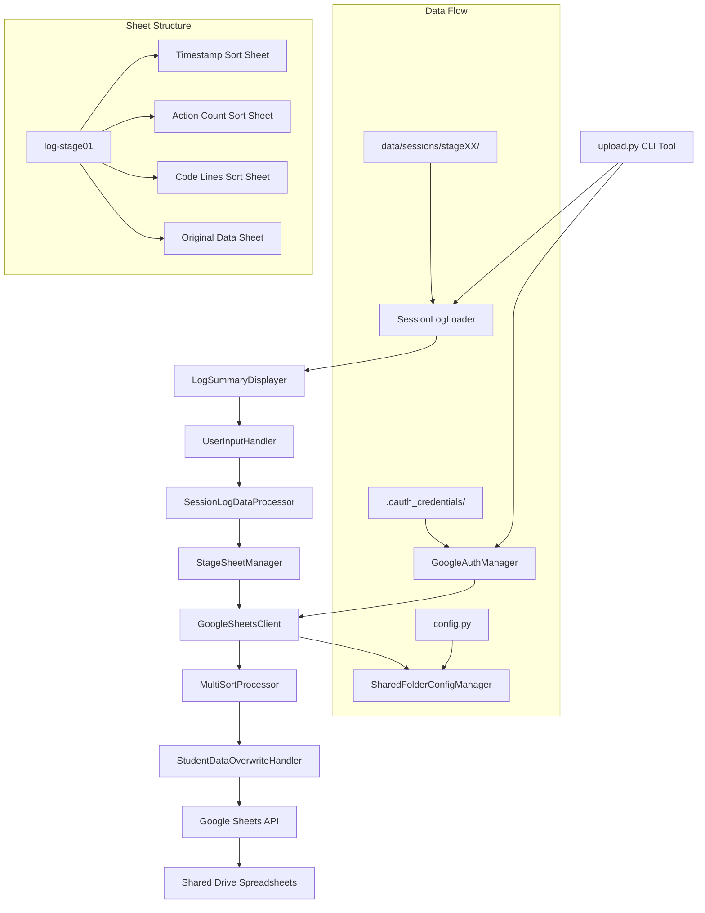
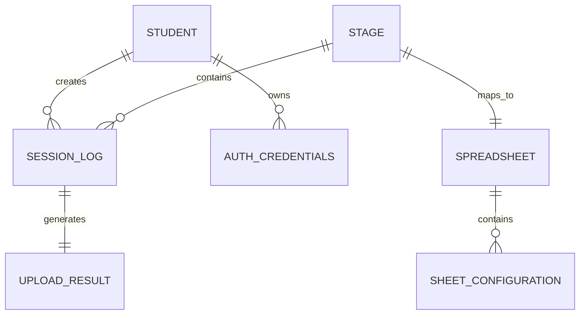

# Technical Design

## Overview

v1.2.3 Google Sheets連携機能は、Python初学者向けローグライク演習フレームワークに学生間セッションログ共有機能を追加する統合システムです。既存のsession_logging.pyとdata_uploader.pyを基盤として、`upload.py`コマンドラインツールを新規開発し、ステージ別Google Sheetsファイル管理とマルチソート表示機能を実現します。

### 研究結果と技術的背景

Google Sheets API統合に関する2025年最新ベストプラクティスの調査により、以下の技術的知見を設計に反映します：

**認証方式の modernization**: 現在のcodebaseは非推奨の`oauth2client`を使用していますが、本設計では`google-auth`への移行とOAuth2フローの実装を行います。

**パフォーマンス最適化**: バッチ操作による API 呼び出し削減と、複数シートの並列更新処理を実装します。

**セキュリティ強化**: スコープ最小化、トークン安全保存、レート制限対応を組み込みます。

## Requirements Mapping

### Design Component Traceability
各設計コンポーネントは特定の要件に対応します：

- **UploadCommandTool** → 1.1, 1.2: セッションログアップロード機能とステージ引数処理
- **GoogleAuthManager** → 2.1-2.5: OAuth認証システムとトークン管理
- **SharedFolderConfigManager** → 3.1-3.4: Google共有フォルダ設定管理
- **StageSheetManager** → 4.1-4.5: ステージ別Sheetsファイル管理とシート構造作成
- **MultiSortProcessor** → 5.1-5.5: 3つのソート表示機能とデータ更新処理
- **StudentDataOverwriteHandler** → 6.1-6.5: 重複アップロード検出と上書き処理
- **SessionLogDataProcessor** → 7.1-7.6: 標準化されたデータ形式処理
- **ErrorHandlingSystem** → 8.1-8.5: 包括的エラーハンドリングとユーザーフィードバック

### User Story Coverage

**学生のアップロード体験**: コマンドライン実行 → ログ選択 → 認証 → アップロード完了の直感的なフローを設計。
**教員の管理体験**: 共有フォルダURL設定のみでクラス全体のログ管理基盤が自動構築される仕組み。
**クラス参加者の閲覧体験**: 3種類のソート表示で多角的な進捗比較が可能な構造。

## Architecture



### Technology Stack

**コアライブラリ**: 
- `gspread` 6.1.2+ (Google Sheets API client)
- `google-auth` 2.23.0+ (OAuth2 authentication, oauth2client replacement)
- `google-auth-oauthlib` 1.1.0+ (OAuth flow handling)

**既存フレームワーク統合**:
- `engine.session_logging` (セッションログ データ構造)  
- `engine.data_uploader` (基盤Google Sheets機能、modernization対象)
- `engine.hyperparameter_manager` (学生ID検証)

**新規開発コンポーネント**:
- `upload.py` (コマンドライン エントリーポイント)
- `engine/google_sheets_uploader.py` (統合アップロード システム)

### Architecture Decision Rationale

**Google Auth Library選択**: oauth2client は 2017年非推奨となり、google-auth が現在の標準。セキュリティ更新とメンテナンス継続性を考慮。

**OAuth2 vs Service Account**: 学生が個人のGoogle アカウントでアクセスする必要があるため、OAuth2 が適切。教員が共有設定するフォルダに学生が書き込み権限を持つ構造。

**4シート構造設計**: ソート処理のパフォーマンス最適化とユーザー体験向上。各ソートビューを事前作成することで、閲覧時の応答性を確保。

**ステージ別ファイル分割**: スケーラビリティとアクセス権限管理。16ステージ × クラス人数のデータ分散により、個別ステージの性能劣化を防止。

## Components and Interfaces

### Backend Services & Method Signatures

#### GoogleSheetsUploader (新規)
```python
class GoogleSheetsUploader:
    """統合Google Sheetsアップロード システム"""
    
    def __init__(self, config_manager: SharedFolderConfigManager):
        self.auth_manager = GoogleAuthManager()
        self.config = config_manager
        self.client: Optional[gspread.Client] = None
    
    def upload_session_log(self, stage_id: str, session_log_path: str) -> UploadResult:
        """セッションログをGoogle Sheetsにアップロード"""
        
    def authenticate_user(self) -> bool:
        """ユーザー認証実行（初回またはトークン期限切れ時）"""
        
    def get_stage_logs_summary(self, stage_id: str) -> List[LogSummaryItem]:
        """指定ステージのセッションログ サマリ取得"""
        
    def ensure_authenticated(self) -> bool:
        """認証状態確認・自動更新"""
```

#### GoogleAuthManager (新規)  
```python
class GoogleAuthManager:
    """OAuth2認証 管理システム"""
    
    def __init__(self, credentials_dir: str = ".oauth_credentials"):
        self.credentials_dir = Path(credentials_dir)
        self.scopes = ['https://www.googleapis.com/auth/spreadsheets', 
                      'https://www.googleapis.com/auth/drive.file']
    
    def get_authenticated_client(self) -> gspread.Client:
        """認証済みgspreadクライアント取得"""
        
    def initiate_oauth_flow(self) -> Credentials:
        """OAuth2フロー開始（ブラウザベース認証）"""
        
    def refresh_credentials(self) -> bool:
        """認証情報リフレッシュ"""
        
    def save_credentials(self, credentials: Credentials) -> None:
        """認証情報安全保存"""
        
    def load_credentials(self) -> Optional[Credentials]:
        """保存済み認証情報読み込み"""
```

#### StageSheetManager (新規)
```python  
class StageSheetManager:
    """ステージ別シート管理システム"""
    
    def __init__(self, client: gspread.Client, shared_folder_url: str):
        self.client = client
        self.shared_folder_url = shared_folder_url
        
    def get_or_create_stage_spreadsheet(self, stage_id: str) -> Spreadsheet:
        """ステージ別スプレッドシート取得・作成"""
        
    def initialize_sheet_structure(self, spreadsheet: Spreadsheet) -> None:
        """4シート構造初期化（Timestamp/ActionCount/CodeLines/Original）"""
        
    def append_student_data(self, spreadsheet: Spreadsheet, 
                           student_data: StudentLogEntry) -> None:
        """学生データ追加・上書き処理"""
```

#### MultiSortProcessor (新規)
```python
class MultiSortProcessor:
    """マルチソート処理システム"""
    
    def __init__(self, spreadsheet: Spreadsheet):
        self.spreadsheet = spreadsheet
        self.sort_definitions = {
            'timestamp': ('end_time', 'desc'),
            'action_count': ('action_count', 'asc'), 
            'code_lines': ('code_lines', 'asc')
        }
    
    def update_all_sort_sheets(self, new_data: StudentLogEntry) -> None:
        """全ソートシート同期更新"""
        
    def apply_sort_to_sheet(self, sheet_name: str, sort_key: str, 
                           sort_order: str) -> None:
        """指定シートにソート適用"""
```

#### StudentDataOverwriteHandler (新規)
```python
class StudentDataOverwriteHandler:
    """学生データ上書き管理"""
    
    def find_existing_student_row(self, sheet: Worksheet, 
                                 student_id: str) -> Optional[int]:
        """既存学生データ行検索"""
        
    def overwrite_student_data(self, sheet: Worksheet, row_index: int,
                              new_data: StudentLogEntry) -> None:
        """学生データ上書き更新"""
        
    def validate_data_integrity(self, spreadsheet: Spreadsheet) -> bool:
        """データ整合性検証（上書き後）"""
```

### Frontend Components
| Component | Responsibility | Props/State |
|-----------|---------------|-------------|
| UploadCommandTool | CLIエントリーポイント・引数解析 | stage_id, session_logs_path |
| LogSummaryDisplayer | セッションログサマリ表示・選択UI | log_list, display_format |  
| UserInputHandler | インデックス選択・確認処理 | selected_index, validation_rules |
| ProgressIndicator | アップロード進捗表示 | current_step, total_steps |
| ErrorMessageDisplayer | エラーメッセージ・解決策表示 | error_type, recovery_suggestions |

### API Endpoints (Google Sheets API使用)

| Method | Endpoint | Purpose | Auth | Status Codes |
|--------|----------|---------|------|--------------|
| GET | `/spreadsheets/{spreadsheet_id}` | スプレッドシート情報取得 | OAuth2 | 200, 401, 403, 404 |
| POST | `/spreadsheets` | 新規スプレッドシート作成 | OAuth2 | 201, 400, 401, 403 |
| PUT | `/spreadsheets/{id}/values/{range}` | データ更新・追加 | OAuth2 | 200, 400, 401, 403 |
| POST | `/spreadsheets/{id}:batchUpdate` | バッチ更新（ソート処理） | OAuth2 | 200, 400, 401, 403 |

## Data Models

### Domain Entities

1. **StudentLogEntry**: 学生のセッションログ エントリ（Google Sheets行データ）
2. **LogSummaryItem**: ログサマリ表示項目（選択UI用）
3. **UploadResult**: アップロード処理結果（成功・エラー情報）
4. **SheetConfiguration**: 各ソートシートの設定情報
5. **AuthCredentials**: OAuth2認証情報（トークン管理）

### Entity Relationships


### Data Model Definitions

```python
@dataclass
class StudentLogEntry:
    """Google Sheetsに記録される学生ログ エントリ"""
    student_id: str  # 6桁数字+英大文字1桁 (例: 123456A)
    end_time: datetime  # ISO8601形式
    completed_successfully: bool  # ゴール到達状況
    action_count: int  # アクション数（正の整数）
    code_lines: int  # コード行数（正の整数）
    solve_code: Optional[str] = None  # ソースコード（オプション表示）
    session_id: str = field(default_factory=lambda: str(uuid.uuid4())[:8])

@dataclass 
class LogSummaryItem:
    """ログサマリ表示項目"""
    index: int  # 表示用インデックス番号
    session_id: str
    end_time: datetime
    completed_successfully: bool
    action_count: int
    code_lines: int
    file_path: str  # セッションログファイルパス

@dataclass
class UploadResult:
    """アップロード処理結果"""
    success: bool
    message: str
    spreadsheet_url: Optional[str] = None
    error_details: Optional[str] = None
    
@dataclass
class SheetConfiguration:
    """シート設定情報"""  
    name: str  # シート名
    sort_column: str  # ソートキー列名
    sort_order: str  # 'asc' or 'desc'
    headers: List[str]  # ヘッダー行
```

### Google Sheets Data Schema

各ステージ スプレッドシート内のシート構造：

**共通ヘッダー構成**:
```
| student_id | end_time | completed_successfully | action_count | code_lines | solve_code |
```

**Timestamp Sort Sheet**: `end_time DESC` (最新順)
**Action Count Sort Sheet**: `action_count ASC` (少ない順)  
**Code Lines Sort Sheet**: `code_lines ASC` (少ない順)
**Original Data Sheet**: 挿入順（ソートなし）

## Error Handling

### エラー分類と対応戦略

#### 1. 認証エラー (Authentication Errors)
```python
class AuthenticationError(Exception):
    """認証関連エラー"""
    pass

# 対応:
# - 初回認証: OAuth2フロー自動開始 → ブラウザ認証
# - トークン期限切れ: リフレッシュトークン使用 → 自動更新
# - 権限不足: スコープ確認 → エラーメッセージ + 解決策表示
```

#### 2. ネットワーク・API エラー
```python
class NetworkError(Exception):
    """ネットワーク接続エラー"""
    pass

class GoogleSheetsAPIError(Exception):
    """Google Sheets APIエラー"""
    pass

# 対応:
# - 接続タイムアウト: 3回リトライ + 指数バックオフ
# - レート制限: 自動待機 + 進捗表示
# - API エラー: エラーコード別メッセージ + 解決策提示
```

#### 3. データ整合性エラー
```python
class DataIntegrityError(Exception):
    """データ整合性エラー"""
    pass

# 対応:
# - 重複検出失敗: 手動確認プロンプト表示
# - ソート処理失敗: Original Dataシートにフォールバック
# - 学生ID形式エラー: バリデーションエラーメッセージ
```

#### 4. 設定エラー
```python
class ConfigurationError(Exception):
    """設定関連エラー"""
    pass

# 対応:
# - 共有フォルダURL未設定: 設定手順ガイド表示
# - 権限不足: 共有設定確認指示
# - ファイル作成失敗: ドライブ容量・権限確認提示
```

### エラーハンドリング実装例
```python
def robust_upload_with_error_handling(session_log_path: str, 
                                     stage_id: str) -> UploadResult:
    """包括的エラーハンドリング付きアップロード"""
    try:
        # メイン処理
        return perform_upload(session_log_path, stage_id)
        
    except AuthenticationError as e:
        return UploadResult(
            success=False,
            message="認証エラーが発生しました。ブラウザで認証を完了してください。",
            error_details=str(e)
        )
        
    except NetworkError as e:
        return UploadResult(
            success=False, 
            message="ネットワーク接続を確認してから再試行してください。",
            error_details=str(e)
        )
        
    except Exception as e:
        logger.error(f"Unexpected error: {e}", exc_info=True)
        return UploadResult(
            success=False,
            message="予期しないエラーが発生しました。管理者に連絡してください。",
            error_details=str(e)
        )
```

## Performance & Scalability

### Performance Targets
| Metric | Target | Measurement |
|--------|--------|-------------|
| Upload Response Time (p95) | < 5秒 | セッションログ1件あたり |
| Upload Response Time (p99) | < 10秒 | ネットワーク遅延含む |
| Batch Update Throughput | > 50 rows/sec | 複数学生データ処理 |
| Authentication Flow (p99) | < 30秒 | 初回OAuth2認証完了まで |
| Sheet Creation Time | < 15秒 | 新規ステージシート作成 |

### Caching Strategy
- **Credential Cache**: OAuth2トークン ローカル暗号化保存 (24時間)
- **Spreadsheet Metadata Cache**: シート情報キャッシュ (10分間)  
- **Student Data Cache**: アップロード前重複チェック用 (セッション中)

### Scalability Approach
- **ステージ並列処理**: 複数ステージ同時アップロード対応
- **バッチ API使用**: Google Sheets batchUpdate で複数操作統合
- **レート制限対応**: 指数バックオフ + jitter によるAPI呼び出し制御
- **部分失敗対応**: シートごと独立処理でエラー影響局所化

### Google Sheets APIレート制限対応
```python
class RateLimitHandler:
    """APIレート制限対応"""
    
    def __init__(self):
        self.requests_per_minute = 300  # Google Sheets API制限
        self.requests_per_100_seconds = 100  # Write操作制限
        self.request_timestamps = []
    
    @retry(
        wait=wait_exponential(multiplier=1, min=1, max=60),
        stop=stop_after_attempt(5),
        retry=retry_if_exception_type(GoogleSheetsAPIError)
    )
    def execute_with_rate_limit(self, api_call):
        """レート制限考慮API実行"""
        self._wait_if_needed()
        return api_call()
```

## Security Considerations

### OAuth2セキュリティ実装
- **PKCE (Proof Key for Code Exchange)**: 認証フロー改ざん防止
- **State Parameter**: CSRF攻撃防止のランダムstate検証  
- **Secure Token Storage**: 認証トークン暗号化ローカル保存
- **Minimal Scopes**: 必要最小権限 (`spreadsheets`, `drive.file`)

### データプライバシー保護
- **学生ID仮名化オプション**: 設定による学生ID匿名化表示
- **ソースコード非表示**: デフォルトでsolve_code列非表示、要求時のみ展開
- **アクセス制御**: 共有フォルダ権限による閲覧制限
- **ログ保持期間**: 設定可能な自動削除機能（GDPR対応）

### セキュリティ監査ログ
```python  
class SecurityAuditLogger:
    """セキュリティ監査ログ"""
    
    def log_authentication_event(self, student_id: str, event_type: str):
        """認証イベント記録"""
        
    def log_data_access(self, student_id: str, stage_id: str, operation: str):
        """データアクセス記録"""
        
    def detect_suspicious_activity(self, student_id: str) -> bool:
        """異常活動検出（大量アップロード等）"""
```

## Testing Strategy

### Risk Matrix
| Area | Risk | Must | Optional | Ref |
|---|---|---|---|---|
| OAuth2認証 | H | Unit, Integration, E2E | Security | 2.1-2.5 |
| Google Sheets API | H | Contract, Integration | Resilience | 4.1-4.5, 5.1-5.5 |
| Data Integrity | H | Unit, Property | Integration | 6.1-6.5, 7.1-7.6 |
| CLI UX Flow | M | E2E (≤3) | Usability | 1.1-1.5, 8.1-8.5 |
| Performance | M | Load testing | Stress | Performance Targets |

### Test Implementation Strategy

#### Unit Tests (pytest)
```python
class TestGoogleSheetsUploader:
    """GoogleSheetsUploader 単体テスト"""
    
    @pytest.fixture
    def mock_session_log(self):
        return StudentLogEntry(
            student_id="123456A",
            end_time=datetime.now(),
            completed_successfully=True,
            action_count=15,
            code_lines=25
        )
    
    def test_session_log_data_validation(self, mock_session_log):
        """セッションログ データ検証テスト"""
        
    def test_student_id_format_validation(self):
        """学生ID形式バリデーション テスト"""
        
    def test_duplicate_student_detection(self, mock_session_log):
        """重複学生データ検出テスト"""

@pytest.mark.asyncio
class TestMultiSortProcessor:
    """マルチソート処理 単体テスト"""
    
    def test_timestamp_sort_logic(self):
        """タイムスタンプソートロジック テスト"""
        
    def test_action_count_sort_logic(self):
        """アクション数ソートロジック テスト"""
        
    def test_data_consistency_across_sheets(self):
        """シート間データ整合性テスト"""
```

#### Contract Tests (Google Sheets API)
```python
class TestGoogleSheetsAPIContract:
    """Google Sheets API契約テスト"""
    
    def test_spreadsheet_creation_contract(self):
        """スプレッドシート作成API契約テスト"""
        
    def test_batch_update_contract(self):
        """バッチ更新API契約テスト"""
        
    def test_oauth2_authentication_contract(self):
        """OAuth2認証API契約テスト"""
```

#### Integration Tests
```python
class TestGoogleSheetsIntegration:
    """Google Sheets統合テスト"""
    
    @pytest.mark.integration
    def test_end_to_end_upload_flow(self):
        """エンドツーエンド アップロードフロー テスト"""
        # 1. セッションログ作成
        # 2. アップロード実行  
        # 3. Google Sheetsデータ検証
        # 4. ソートシート確認
        
    @pytest.mark.integration  
    def test_duplicate_student_overwrite(self):
        """重複学生データ上書き統合テスト"""
```

#### End-to-End Tests (≤3 critical flows)
```python
class TestCriticalUserFlows:
    """重要ユーザーフロー E2Eテスト"""
    
    @pytest.mark.e2e
    def test_first_time_user_upload_flow(self):
        """初回ユーザー アップロードフロー"""
        # CLI実行 → 認証 → ログ選択 → アップロード → 成功確認
        
    @pytest.mark.e2e
    def test_returning_user_upload_flow(self):
        """既存ユーザー アップロードフロー"""
        # CLI実行 → 自動認証 → ログ選択 → アップロード → 上書き確認
        
    @pytest.mark.e2e
    def test_error_recovery_flow(self):
        """エラー回復フロー"""
        # ネットワークエラー → リトライ → 成功
```

### CI Gates
| Stage | Run | Gate | SLA |
|---|---|---|---|
| PR | Unit + Contract | Fail = block | ≤5分 |
| Staging | Integration + E2E | Fail = block | ≤15分 |
| Nightly | Performance/Security | Regression → issue | - |

### Test Data Management
```python
@pytest.fixture(scope="session")
def test_google_sheets_environment():
    """テスト用Google Sheets環境"""
    # テスト専用共有フォルダ作成
    # サービスアカウント権限設定
    # テスト後クリーンアップ
    
@pytest.fixture  
def sample_session_logs():
    """サンプルセッションログデータ"""
    return [
        create_sample_log("123456A", completed=True, actions=10),
        create_sample_log("123456B", completed=False, actions=25),
        create_sample_log("123456C", completed=True, actions=8),
    ]
```

### Exit Criteria
- **Severity 1/2 bugs**: 0件
- **All CI gates passed**: ユニット、契約、統合、E2Eテスト全通過
- **Performance targets met**: 応答時間・スループプット目標達成
- **Security review completed**: OAuth2フロー・データ保護監査完了
- **Manual acceptance testing**: 教員・学生による受け入れテスト合格