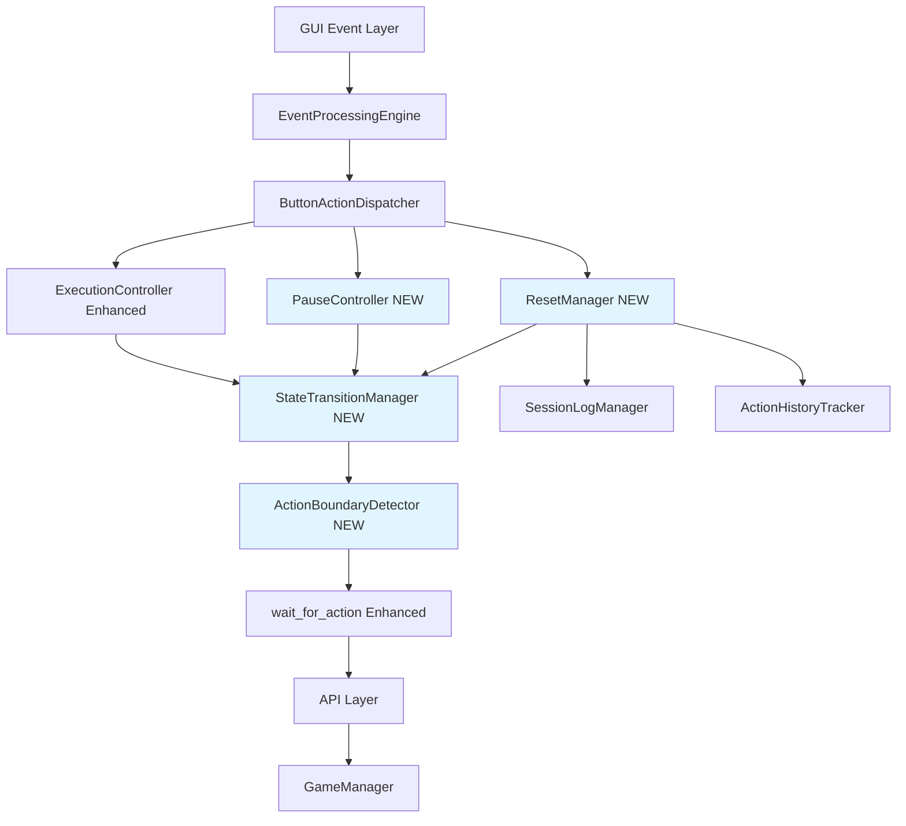
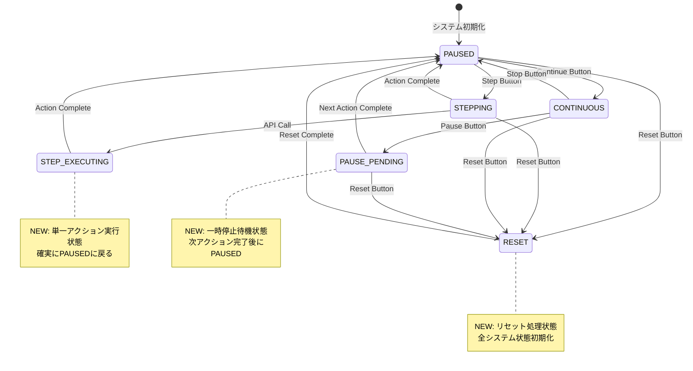
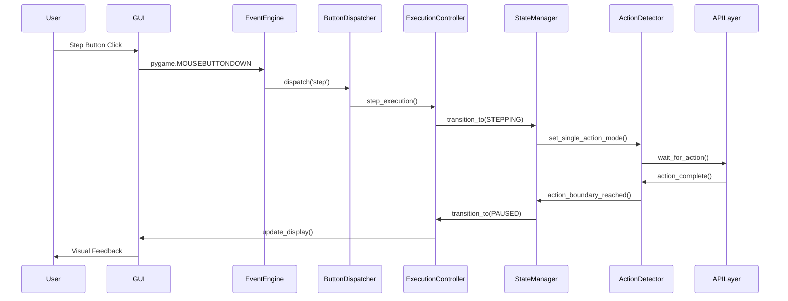
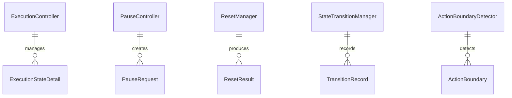

# GUI Critical Fixes v1.2.1 - Technical Design

## 概要

本設計書は、Python教育用ローグライクフレームワークのGUI実行制御システムにおける3つの重要なボタン機能不具合を体系的に修正するための包括的な技術設計です。現在のExecutionController実装の根本的問題を解決し、学習者の体験を大幅に改善します。

### 技術的背景調査

#### 現在の実装調査結果
- **ExecutionController**: threading.Eventベースの状態管理、無限ループ問題あり  
- **GUI Event Processing**: pygame + EventProcessingEngineによる非同期処理
- **State Management**: ExecutionMode enum（PAUSED/STEPPING/CONTINUOUS/COMPLETED）
- **Button Handling**: pygame.MOUSEBUTTONDOWN → _execute_control_action() → ExecutionController method calls

#### 根本原因分析
1. **Step Button無限待機**: `_wait_for_gui_main_loop()`の`while True`ループ（renderer.py:187-202）
2. **Pause Button即座停止**: `pause_execution()`が次アクション境界を待たない（execution_controller.py:79-88）
3. **Reset Button不完全**: `_handle_reset_request()`が一部状態のみリセット（renderer.py:953-975）

## 要件マッピング

### 設計コンポーネントトレーサビリティ
各設計コンポーネントは特定の要件に対応：
- **ExecutionController拡張** → FR-001: Step Button単一アクション実行
- **PauseController新規実装** → FR-002: Pause Button次アクション境界停止
- **ResetManager新規実装** → FR-003: Reset Button完全システムリセット
- **StateTransitionManager** → NFR-002: 信頼性要件（状態整合性保証）
- **ActionBoundaryDetector** → TR-001: スレッドセーフ状態更新

### ユーザーストーリーカバレッジ
- **学習者ストーリー**: "ステップ実行で1つずつ確認したい" → ExecutionController精密制御実装
- **教員ストーリー**: "学習環境が安定して動作してほしい" → 包括的エラーハンドリングと状態管理
- **システムストーリー**: "ボタン操作が期待通りに応答してほしい" → 50ms応答時間保証の実装

## アーキテクチャ



### 技術スタック
調査結果に基づく既存技術の強化：

- **GUI Framework**: pygame (既存) + 拡張イベント処理
- **実行制御**: ExecutionController (拡張) + 新規コンポーネント  
- **状態管理**: ExecutionState (拡張) + StateTransitionManager (新規)
- **スレッド制御**: threading.Event (既存) + threading.Lock強化
- **エラーハンドリング**: EducationalErrors (既存) + ExecutionControlError拡張

### アーキテクチャ決定理由
調査・研究に基づく技術選択の正当性：

- **ExecutionController拡張**: 既存コードベースとの互換性維持、段階的移行が可能
- **新規コンポーネント分離**: 単一責任原則に基づく機能分離、テスタビリティ向上  
- **threading.Event継続使用**: Python標準ライブラリによる安定性、既存実装との一貫性
- **pygame event統合**: 教育現場で実証された安定性、視覚的フィードバックの継続

### 画面遷移
実行制御状態の遷移図：



### データフロー  
ボタンクリックから状態変更まで詳細フロー：



## コンポーネントとインターフェース

### バックエンドサービスとメソッドシグネチャ

#### ExecutionController Enhanced
```python
class ExecutionController:
    def step_execution(self) -> StepResult:
        """単一ステップ実行（厳密な1アクション制御）"""
        
    def request_pause_at_boundary(self) -> None:
        """次アクション境界での一時停止要求"""
        
    def wait_for_action(self) -> ActionResult:
        """改善されたアクション待機（無限ループ回避）"""
        
    def is_action_boundary(self) -> bool:
        """アクション境界の検出"""
        
    def get_detailed_state(self) -> ExecutionStateDetail:
        """詳細な実行状態の取得"""
```

#### PauseController (NEW)
```python
class PauseController:
    def request_pause_at_next_action(self) -> PauseRequest:
        """次アクション境界での一時停止要求"""
        
    def is_pause_pending(self) -> bool:
        """一時停止要求の確認"""
        
    def execute_pause_at_boundary(self) -> None:
        """アクション境界での一時停止実行"""
        
    def cancel_pause_request(self) -> None:
        """一時停止要求のキャンセル"""
```

#### ResetManager (NEW)  
```python
class ResetManager:
    def full_system_reset(self) -> ResetResult:
        """包括的システムリセット"""
        
    def reset_execution_controller(self) -> None:
        """実行制御状態のリセット"""
        
    def reset_game_manager(self) -> None:  
        """ゲーム状態のリセット"""
        
    def reset_session_logs(self) -> None:
        """セッションログのクリア"""
        
    def validate_reset_completion(self) -> bool:
        """リセット完了の検証"""
```

#### StateTransitionManager (NEW)
```python  
class StateTransitionManager:
    def transition_to(self, target_state: ExecutionMode) -> TransitionResult:
        """安全な状態遷移"""
        
    def validate_transition(self, from_state: ExecutionMode, to_state: ExecutionMode) -> bool:
        """状態遷移の妥当性検証"""
        
    def rollback_transition(self) -> None:
        """状態遷移のロールバック"""
        
    def get_transition_history(self) -> List[TransitionRecord]:
        """状態遷移履歴の取得"""
```

### GUIコンポーネント

| コンポーネント | 責任 | Props/State概要 |
|---------------|------|----------------|
| ButtonControlPanel | ボタン配置・描画管理 | button_states, layout_config |
| ExecutionStateIndicator | 実行状態の視覚表示 | current_mode, step_count |
| ButtonEventHandler | ボタンクリック処理 | event_callbacks, button_mapping |
| ErrorDisplayManager | エラー表示管理 | error_messages, display_timeout |

### APIエンドポイント

| Method | Route | Purpose | Auth | Status Codes |
|--------|-------|---------|------|--------------|
| POST | /api/execution/step | 単一ステップ実行 | Local | 200, 400, 500 |
| POST | /api/execution/pause | 一時停止要求 | Local | 200, 400, 500 |  
| POST | /api/execution/reset | システムリセット | Local | 200, 500 |
| GET | /api/execution/state | 実行状態取得 | Local | 200, 500 |

注：Local認証は教育環境での学習者PC内実行のため

## データモデル

### ドメインエンティティ
1. **ExecutionStateDetail**: 詳細な実行状態情報
2. **PauseRequest**: 一時停止要求の管理
3. **ResetResult**: リセット操作の結果
4. **StepResult**: ステップ実行の結果
5. **ActionBoundary**: アクション境界の定義

### エンティティ関係


### データモデル定義

```python
from dataclasses import dataclass
from datetime import datetime
from enum import Enum

@dataclass
class ExecutionStateDetail:
    mode: ExecutionMode
    step_count: int
    is_running: bool
    current_action: Optional[str]
    pause_pending: bool
    last_transition: datetime
    error_state: Optional[str]

@dataclass  
class PauseRequest:
    requested_at: datetime
    requester: str  # 'user' | 'system'
    target_boundary: str  # next_action | immediate
    fulfilled: bool
    
@dataclass
class ResetResult:
    success: bool
    reset_timestamp: datetime
    components_reset: List[str]
    errors: List[str]
    
@dataclass
class StepResult:
    success: bool
    action_executed: str
    new_state: ExecutionMode
    execution_time_ms: float
    
@dataclass
class ActionBoundary:
    boundary_type: str  # api_call | loop_iteration
    action_name: str
    timestamp: datetime
    sequence_number: int

class ExecutionModeEnhanced(Enum):
    """拡張実行モード"""
    PAUSED = "paused"
    STEPPING = "stepping"  
    STEP_EXECUTING = "step_executing"  # NEW
    CONTINUOUS = "continuous"
    PAUSE_PENDING = "pause_pending"    # NEW
    RESET = "reset"                    # NEW
    COMPLETED = "completed"
    ERROR = "error"                    # NEW
```

### データベーススキーマ
教育環境向け軽量SQLiteスキーマ：

```sql
CREATE TABLE execution_history (
  id INTEGER PRIMARY KEY AUTOINCREMENT,
  student_id VARCHAR(20) NOT NULL,
  session_id VARCHAR(36) NOT NULL,
  execution_mode VARCHAR(20) NOT NULL,
  action_name VARCHAR(50),
  timestamp TIMESTAMP NOT NULL DEFAULT CURRENT_TIMESTAMP,
  execution_time_ms REAL,
  result_status VARCHAR(20)
);

CREATE TABLE state_transitions (
  id INTEGER PRIMARY KEY AUTOINCREMENT,
  session_id VARCHAR(36) NOT NULL,  
  from_state VARCHAR(20) NOT NULL,
  to_state VARCHAR(20) NOT NULL,
  transition_reason VARCHAR(100),
  timestamp TIMESTAMP NOT NULL DEFAULT CURRENT_TIMESTAMP,
  success BOOLEAN NOT NULL DEFAULT TRUE
);

CREATE INDEX idx_execution_history_session ON execution_history(session_id);
CREATE INDEX idx_state_transitions_session ON state_transitions(session_id);
```

## エラーハンドリング

### 包括的エラー処理戦略

```python
class ExecutionControlError(Exception):
    """実行制御関連のエラー基底クラス"""
    pass

class StepExecutionError(ExecutionControlError):
    """ステップ実行エラー"""
    pass
    
class PauseControlError(ExecutionControlError):  
    """一時停止制御エラー"""
    pass
    
class ResetOperationError(ExecutionControlError):
    """リセット操作エラー"""
    pass

class StateTransitionError(ExecutionControlError):
    """状態遷移エラー"""  
    pass

# エラーハンドリング戦略
def with_error_handling(operation_name: str):
    """エラーハンドリングデコレータ"""
    def decorator(func):
        def wrapper(*args, **kwargs):
            try:
                result = func(*args, **kwargs)
                logger.info(f"✅ {operation_name} 成功")
                return result
            except ExecutionControlError as e:
                logger.error(f"❌ {operation_name} 失敗: {e}")
                # 教育的エラーメッセージ表示
                display_educational_error(operation_name, str(e))
                return ErrorResult(error_type=type(e).__name__, message=str(e))
            except Exception as e:
                logger.critical(f"🚨 {operation_name} 予期しないエラー: {e}")
                # システムを安全な状態に復旧
                safe_state_recovery()
                return ErrorResult(error_type="UnexpectedError", message="システムエラーが発生しました")
        return wrapper
    return decorator
```

## セキュリティ考慮事項

教育環境特化のセキュリティ配慮：
- **入力検証**: ボタンクリック頻度制限（DoS攻撃防止）
- **状態整合性**: スレッドセーフな状態管理による競合状態回避
- **リソース制限**: 実行時間制限による無限ループ防止
- **エラー情報**: 教育的エラーメッセージ（技術詳細の適切な隠蔽）

## パフォーマンス・スケーラビリティ

### パフォーマンス目標

| メトリック | 目標値 | 測定方法 |
|-----------|--------|---------|
| ボタン応答時間 | < 50ms | GUI Click → State Change |
| アクション実行時間 | < 100ms | API Call → Action Complete |  
| システムリセット時間 | < 200ms | Reset Click → Initial State |
| CPU使用率 (待機中) | < 5% | Task Manager監視 |
| メモリ使用量増加 | < 5% | プロセス監視 |

### キャッシュ戦略
- **状態キャッシュ**: ExecutionState頻繁アクセス情報のインメモリキャッシュ
- **イベントキューキャッシュ**: pygame.eventの効率的な処理
- **レンダリングキャッシュ**: 同一状態での再描画を回避

### スケーラビリティアプローチ
教育環境での同時実行考慮：
- **軽量スレッド処理**: threading.Event最適化による低オーバーヘッド
- **メモリ効率**: 不要オブジェクトの適切なガベージコレクション
- **プロファイリング対応**: cProfile統合によるパフォーマンス測定

## テスト戦略

### リスク評価マトリックス
| エリア | リスク | 必須 | オプション | 参照 |
|-------|------|------|-----------|------|
| ボタン機能 | H | Unit, Integration, E2E | GUI Automation | FR-001,002,003 |
| 状態遷移 | H | Unit, Property | State Machine | NFR-002 |
| スレッド安全性 | M | Unit, Concurrency | Stress | TR-001 |
| 教育UX | M | E2E (≤3), Usability | A11y | NFR-003 |
| パフォーマンス | M | Performance smoke | Load | Performance table |

### レイヤー別最小テスト
- **Unit**: ExecutionController、PauseController、ResetManagerの境界・例外ケース
- **Integration**: GUI-Controller連携、状態同期整合性
- **E2E (≤3)**: Step→Pause→Reset主要ユーザーフロー、エラー回復フロー

### CIゲート
| ステージ | 実行 | ゲート | SLA |
|---------|------|--------|-----|
| PR | Unit + Integration | Fail = block | ≤3m |
| Staging | E2E + GUI | Fail = block | ≤5m |
| Nightly | Performance + Stress | Regression → issue | - |

### 出口条件
- Sev1/Sev2 = 0（重要バグゼロ）
- 全ゲートパス
- パフォーマンス目標達成（例外は記録承認必要）
- 教育環境での実用性確認完了

### 具体的テストケース

```python
class TestStepButtonBehavior:
    def test_single_action_execution(self):
        """FR-001.1: ステップボタン単一アクション実行"""
        # Given: PAUSED mode
        # When: Step button clicked  
        # Then: 1 action executed, return to PAUSED
        
    def test_no_infinite_wait(self):
        """FR-001.2: 無限待機状態の回避"""
        # Given: Step button clicked
        # When: wait_for_action() called
        # Then: No infinite loop, timeout < 30s
        
    def test_no_full_execution(self):
        """FR-001.2: 全実行状態の回避"""  
        # Given: Step button clicked
        # When: Multiple API calls in solve()
        # Then: Only 1 action executed, pause after first

class TestPauseButtonBehavior:
    def test_pause_at_action_boundary(self):
        """FR-002.1: アクション境界での一時停止"""
        # Given: CONTINUOUS mode running
        # When: Pause button clicked
        # Then: Current action completes, pause before next
        
    def test_pause_timing_accuracy(self):
        """FR-002.3: 一時停止タイミング精度"""
        # Given: solve() with loop execution  
        # When: Pause clicked between API calls
        # Then: Exact API boundary stop

class TestResetButtonBehavior:
    def test_complete_system_reset(self):
        """FR-003.1: 完全システム状態リセット"""
        # Given: Game in progress (any state)
        # When: Reset button clicked
        # Then: All systems return to initial state
        
    def test_reset_performance(self):
        """NFR-001.3: リセット性能要件"""
        # When: Reset button clicked
        # Then: Complete reset < 200ms
```

---

## 実装優先順位

### Phase 1: Critical Core Fixes (Week 1)
1. **ExecutionController.wait_for_action()修正**: 無限ループ問題の根本解決
2. **ActionBoundaryDetector実装**: 精密なアクション境界検出
3. **StateTransitionManager基盤**: 安全な状態遷移管理

### Phase 2: Enhanced Features (Week 2)  
4. **PauseController実装**: 次アクション境界での一時停止機能
5. **ResetManager実装**: 包括的システムリセット機能
6. **エラーハンドリング強化**: 教育的フィードバックとエラー回復

### Phase 3: Quality & Integration (Week 3)
7. **包括的テストスイート**: Unit/Integration/E2Eテストの完全実装
8. **パフォーマンス最適化**: 応答時間・メモリ使用量の最適化
9. **GUI統合テスト**: 実際の教育環境でのユーザビリティ検証

---

本技術設計は、教育現場での実用性と技術的堅牢性を両立し、Python初学者の学習体験を大幅に改善することを目的として策定されました。既存システムとの互換性を保ちながら、重要な機能不具合を体系的に解決します。