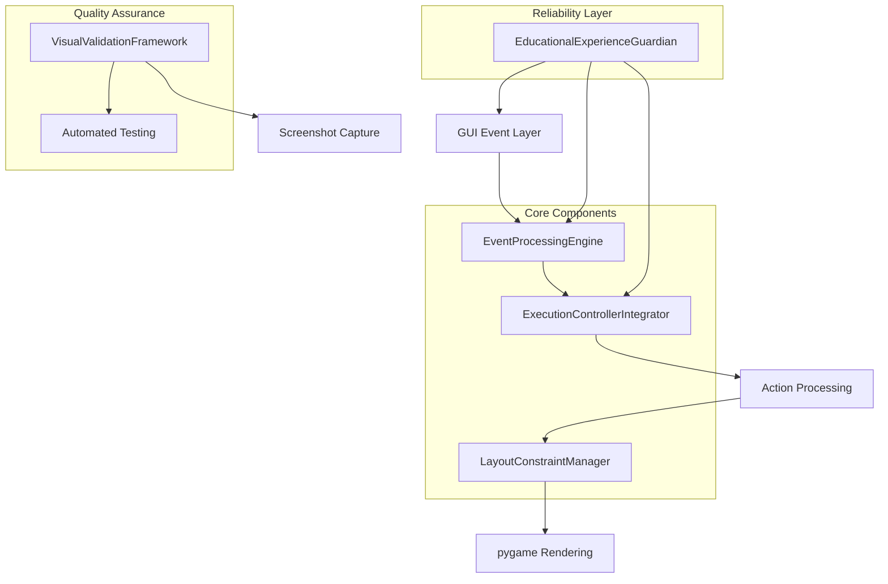
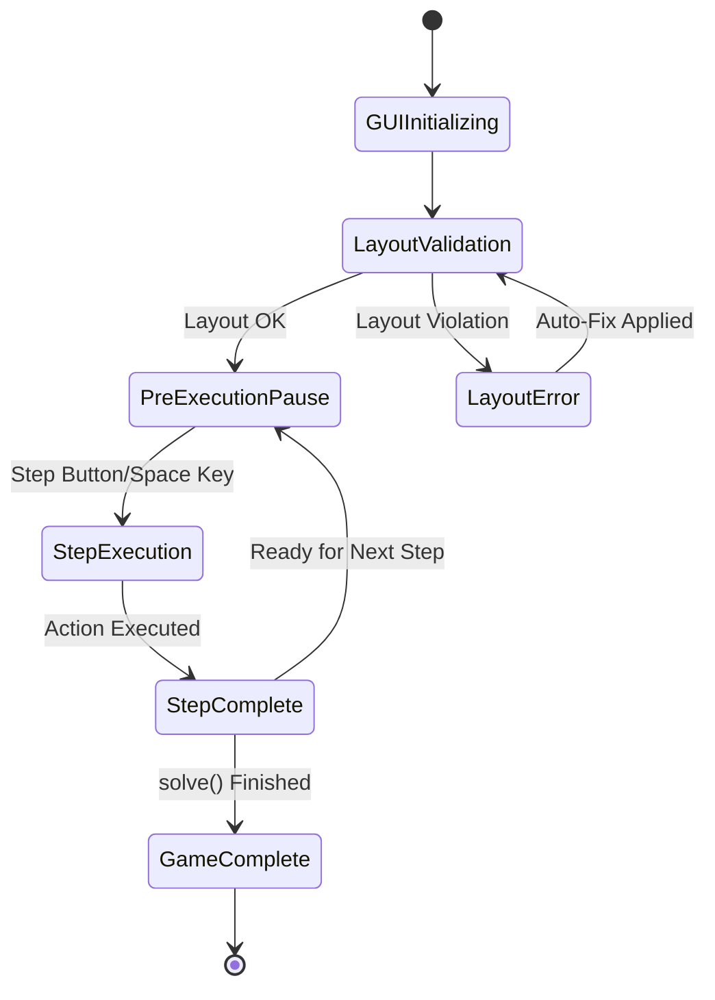
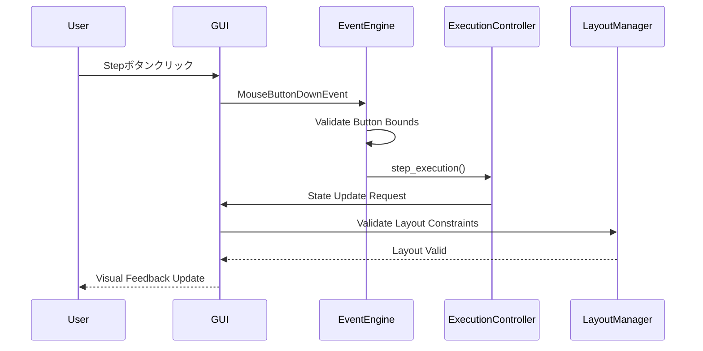
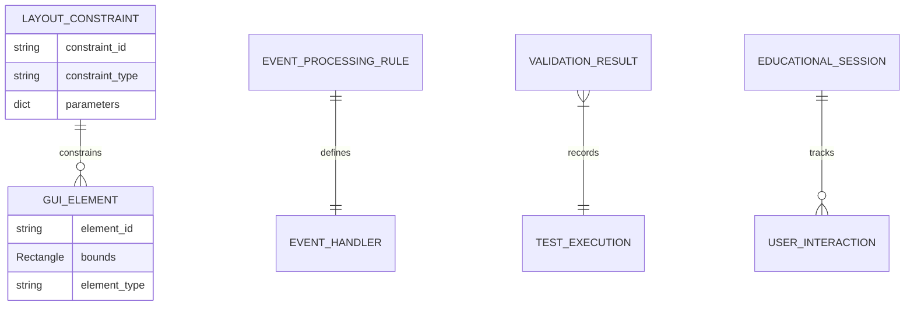

# 技術設計書

## 概要

v1.1のGUI拡張機能における2つの致命的な問題（レイアウト重複とステップ実行不動作）の根本修正を目的とした技術設計書です。pygame基盤のGUIシステムにおいて、厳密なレイアウト制約管理とイベント処理の信頼性向上を通じて、学習者の中断されない教育体験を実現します。

## 要求仕様マッピング

### 設計コンポーネントのトレーサビリティ

各設計コンポーネントが対応する具体的要求仕様：

- **LayoutConstraintManager** → 1.1-1.5: GUIレイアウト重複問題の根本修正
- **EventProcessingEngine** → 2.1-2.6, 3.1-3.5: ステップ実行制御機能とイベント処理システム
- **ExecutionControllerIntegrator** → 2.5, 3.3: ExecutionControllerとAPIレイヤー間の確実な連携
- **VisualValidationFramework** → 4.1-4.5: 視覚的検証とテスト要件
- **EducationalExperienceGuardian** → 5.1-5.5: 教育的体験の連続性保証

### ユーザーストーリーカバレッジ

- **初学者のUI視認性**: LayoutConstraintManagerによる厳密な境界管理
- **段階的コード実行体験**: EventProcessingEngineによる確実なステップ実行
- **システム管理者の品質保証**: VisualValidationFrameworkによる検証体制
- **開発者の検証効率**: 自動テストとスクリーンショット比較機能
- **学習の連続性**: EducationalExperienceGuardianによる堅牢性確保

## アーキテクチャ



### 技術スタック

既存のv1.1アーキテクチャを基盤とし、問題解決に特化した拡張：

- **GUI Framework**: pygame (既存) + 拡張レイアウト制約システム
- **Event Processing**: pygame.event + 強化されたイベントハンドラー優先度管理
- **State Management**: ExecutionController (既存) + 信頼性向上パッチ
- **Testing Framework**: pytest (既存) + GUI視覚的検証拡張
- **Layout Engine**: Custom LayoutConstraintManager (新規)
- **Validation Tools**: PIL/Pillow for screenshot comparison (新規)

### アーキテクチャ決定の根拠

研究結果に基づく主要技術選択の理由：

- **pygame継続使用**: 既存のv1.1実装との互換性維持、学習コストの最小化
- **Custom LayoutConstraintManager**: pygameの制約に対応した専用レイアウト計算エンジン
- **Event Processing Enhancement**: pygameのイベント処理順序問題に対応する信頼性向上
- **Visual Validation Integration**: 教育ソフトウェアの品質保証要件に対応

### 画面遷移



### データフロー

#### 主要ユーザーフローのシーケンス図



## コンポーネント・インターフェース

### Backend Services & Method Signatures

#### LayoutConstraintManager
```python
class LayoutConstraintManager:
    def calculate_info_panel_bounds(self, game_area_width: int, margin: int) -> pygame.Rect:
        """下部情報パネルの境界を厳密に計算"""
    
    def validate_layout_constraints(self, info_rect: pygame.Rect, sidebar_x: int) -> bool:
        """レイアウト制約違反を検証"""
    
    def apply_safe_layout_bounds(self, base_rect: pygame.Rect) -> pygame.Rect:
        """安全なレイアウト境界を適用"""
    
    def get_max_text_width(self, available_width: int, font: pygame.font.Font) -> int:
        """指定幅内でのテキスト最大幅を計算"""
```

#### EventProcessingEngine
```python
class EventProcessingEngine:
    def process_mouse_events(self, event: pygame.event.Event) -> bool:
        """マウスイベントを100%確実に処理"""
    
    def validate_button_collision(self, mouse_pos: tuple, button_rects: dict) -> Optional[str]:
        """ボタンクリック領域判定を正確に実行"""
    
    def handle_keyboard_shortcuts(self, event: pygame.event.Event) -> bool:
        """キーボードショートカット処理"""
    
    def ensure_event_priority(self, events: List[pygame.event.Event]) -> List[pygame.event.Event]:
        """イベント処理優先順位を管理"""
```

#### ExecutionControllerIntegrator
```python
class ExecutionControllerIntegrator:
    def initialize_controller_connection(self, api_layer: Any, renderer: Any) -> bool:
        """ExecutionControllerとの連携を確実に確立"""
    
    def validate_controller_state(self) -> bool:
        """ExecutionController状態の整合性を検証"""
    
    def synchronize_gui_state(self, execution_state: ExecutionMode) -> None:
        """GUI状態とExecution状態を同期"""
    
    def handle_controller_errors(self, error: Exception) -> bool:
        """ExecutionController関連エラーのハンドリング"""
```

#### VisualValidationFramework
```python
class VisualValidationFramework:
    def capture_gui_screenshot(self, filename: str) -> bool:
        """GUI状態のスクリーンショット取得"""
    
    def compare_layout_screenshots(self, before: str, after: str) -> dict:
        """レイアウト修正前後の比較分析"""
    
    def validate_button_positions(self) -> List[dict]:
        """ボタン位置の正確性検証"""
    
    def run_regression_tests(self) -> bool:
        """回帰テスト実行"""
```

### GUI Components

| Component | Responsibility | State/Props Summary |
|-----------|----------------|---------------------|
| EnhancedInfoPanel | 下部情報表示・制約遵守 | bounds, text_content, font_size |
| ReliableControlPanel | 実行制御ボタン・確実動作 | button_states, event_handlers, controller_ref |
| LayoutConstraintValidator | レイアウト制約チェック | constraint_rules, violation_alerts |
| EventReliabilityMonitor | イベント処理監視 | event_queue, processing_stats |

### Core Interfaces

#### ILayoutConstraint
```python
from abc import ABC, abstractmethod

class ILayoutConstraint(ABC):
    @abstractmethod
    def validate(self, element_bounds: pygame.Rect, context: dict) -> bool:
        """制約違反チェック"""
    
    @abstractmethod
    def get_violation_message(self) -> str:
        """制約違反時のメッセージ取得"""
```

#### IEventProcessor
```python
class IEventProcessor(ABC):
    @abstractmethod
    def can_handle(self, event: pygame.event.Event) -> bool:
        """イベント処理可能性判定"""
    
    @abstractmethod
    def process(self, event: pygame.event.Event) -> bool:
        """イベント処理実行"""
```

## データモデル

### Domain Entities

1. **LayoutConstraint**: GUI要素の配置制約定義
2. **EventProcessingRule**: イベント処理規則と優先度
3. **ValidationResult**: 検証結果とメトリクス
4. **EducationalSession**: 学習セッション状態管理

### Entity Relationships



### Data Model Definitions

```python
@dataclass
class LayoutConstraint:
    constraint_id: str
    element_type: str  # "info_panel", "control_panel", "sidebar"
    bounds: pygame.Rect
    max_width: int
    max_height: int
    margin_requirements: dict
    created_at: datetime
    
@dataclass
class EventProcessingMetrics:
    event_type: str
    processing_time_ms: float
    success_rate: float
    error_count: int
    last_processed: datetime

@dataclass
class ValidationResult:
    test_id: str
    test_type: str  # "layout", "event", "integration"
    passed: bool
    error_message: Optional[str]
    screenshot_path: Optional[str]
    execution_time_ms: float
    timestamp: datetime
```

### Configuration Schema

```python
@dataclass
class GUIConstraintConfig:
    # レイアウト制約設定
    info_panel_max_width_ratio: float = 0.9  # ゲームエリア幅の90%
    sidebar_min_margin: int = 10              # サイドバーとの最小間隔
    button_safe_area_padding: int = 5         # ボタン周辺の安全領域
    
    # イベント処理設定
    event_processing_timeout_ms: int = 100    # イベント処理タイムアウト
    max_event_queue_size: int = 50            # イベントキューサイズ上限
    
    # 検証設定
    screenshot_comparison_threshold: float = 0.95  # スクリーンショット一致度
    regression_test_iterations: int = 3            # 回帰テスト実行回数
```

## エラーハンドリング

### Error Categories & Response Strategy

```python
class GUIError(Exception):
    """GUI関連エラーの基底クラス"""
    pass

class LayoutConstraintViolation(GUIError):
    """レイアウト制約違反エラー"""
    def __init__(self, constraint_type: str, violation_details: dict):
        self.constraint_type = constraint_type
        self.violation_details = violation_details
        super().__init__(f"Layout constraint violated: {constraint_type}")

class EventProcessingError(GUIError):
    """イベント処理エラー"""
    def __init__(self, event_type: str, processing_stage: str):
        self.event_type = event_type
        self.processing_stage = processing_stage
        super().__init__(f"Event processing failed: {event_type} at {processing_stage}")

class ExecutionControllerConnectionError(GUIError):
    """ExecutionController連携エラー"""
    def __init__(self, connection_stage: str):
        self.connection_stage = connection_stage
        super().__init__(f"ExecutionController connection failed: {connection_stage}")
```

### Error Recovery Strategies

```python
class ErrorRecoveryManager:
    def recover_from_layout_violation(self, violation: LayoutConstraintViolation) -> bool:
        """レイアウト制約違反からの自動復旧"""
        # Auto-adjust layout bounds
        # Apply safe fallback dimensions
        # Re-validate constraints
        
    def recover_from_event_processing_error(self, error: EventProcessingError) -> bool:
        """イベント処理エラーからの復旧"""
        # Clear event queue
        # Reset event handlers
        # Re-initialize event processing
        
    def recover_from_controller_connection_error(self, error: ExecutionControllerConnectionError) -> bool:
        """ExecutionController接続エラーからの復旧"""
        # Re-establish controller connection
        # Validate API layer integration
        # Reset controller state
```

## セキュリティ考慮事項

### Input Validation
- マウス座標値の範囲検証（画面境界内制限）
- イベントデータの整合性チェック
- ユーザー入力の悪意ある操作防止

### Error Information Exposure
- 教育環境向けの安全なエラーメッセージ表示
- デバッグ情報の適切な制御
- 学習者に対するError境界の設定

## パフォーマンス・スケーラビリティ

### Performance Targets

| Metric | Target | Measurement |
|--------|--------|-------------|
| Layout Constraint Validation | < 5ms | レイアウト計算時間 |
| Event Processing Latency | < 10ms | クリック→レスポンス |
| GUI Render Frame Rate | > 30 FPS | pygame display update |
| Memory Usage (GUI Components) | < 50MB | Additional to base system |
| Screenshot Comparison | < 500ms | Visual validation |

### Optimization Strategy

- **Layout Calculation Caching**: 計算結果キャッシュによる高速化
- **Event Queue Optimization**: 優先度ベースイベント処理
- **Lazy Screenshot Validation**: 必要時のみスクリーンショット取得
- **Memory-Efficient Error Tracking**: 軽量エラー履歴管理

## テスト戦略

### Risk Matrix

| Area | Risk | Must | Optional | Ref |
|---|---|---|---|---|
| Layout Constraints | H | Unit, Visual Validation | Cross-resolution | 1.1-1.5 |
| Event Processing | H | Unit, Integration, E2E | Stress Testing | 2.1-2.6, 3.1-3.5 |
| Controller Integration | M | Contract, Integration | Performance | 2.5, 3.3 |
| Visual Validation | M | Automated Screenshot | Manual Review | 4.1-4.5 |
| Educational Experience | L | E2E (3 flows) | Accessibility | 5.1-5.5 |

### Test Implementation by Layer

#### Unit Tests
```python
def test_layout_constraint_validation():
    """レイアウト制約検証のユニットテスト"""
    manager = LayoutConstraintManager()
    info_rect = pygame.Rect(0, 0, 400, 80)
    sidebar_x = 500
    assert manager.validate_layout_constraints(info_rect, sidebar_x) == True

def test_event_processing_reliability():
    """イベント処理信頼性のユニットテスト"""
    engine = EventProcessingEngine()
    test_event = create_mock_mouse_event((100, 100))
    result = engine.process_mouse_events(test_event)
    assert result == True
```

#### Integration Tests
```python
def test_execution_controller_integration():
    """ExecutionController統合テスト"""
    integrator = ExecutionControllerIntegrator()
    api_layer = MockAPILayer()
    renderer = MockRenderer()
    assert integrator.initialize_controller_connection(api_layer, renderer) == True

def test_gui_event_flow():
    """GUI全体イベントフローテスト"""
    # ユーザークリック → イベント処理 → 状態更新 → GUI更新の統合テスト
```

#### E2E Tests (≤3 Critical Flows)
1. **Step Execution Flow**: ユーザークリック→ステップ実行→GUI更新
2. **Layout Validation Flow**: 起動→レイアウト検証→正常表示
3. **Error Recovery Flow**: エラー発生→自動復旧→継続動作

### CI Gates

| Stage | Run | Gate | SLA |
|---|---|---|---|
| PR | Unit + Layout Tests | Fail = block | ≤ 2min |
| Integration | Integration + Visual | Fail = block | ≤ 5min |
| Nightly | E2E + Regression | Report Only | ≤ 15min |

### Test Exit Criteria
- Sev1/Sev2 defects = 0（レイアウト重複・ステップ実行不動作）
- All CI gates passed
- Visual validation success rate > 95%
- Event processing reliability > 99%
- Performance targets met（レスポンス時間・メモリ使用量）