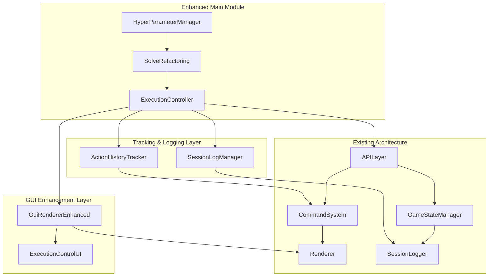
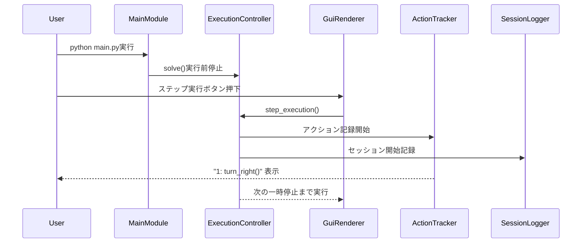
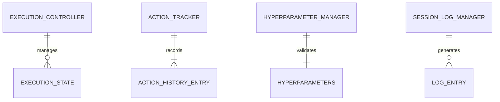

# 技術設計書

## 概要
GUI拡張機能v1.1は、現在のpygameベースのGUIレンダラーに実行制御UI、main.pyの構造改善、アクション履歴機能、セッションログの有効化を統合実装します。既存のコマンドパターン、レンダラー基盤、APIレイヤーを活用し、学習者の体験的理解を大幅に向上させます。

## 要求仕様マッピング

### 設計コンポーネント追跡性
各設計コンポーネントは具体的な要求仕様に対応:
- **ExecutionController** → 1.1-1.6: GUI実行制御機能のEARS要求
- **MainStructureRefactor** → 2.1-2.6: main.py構造改善のEARS要求  
- **ActionHistoryTracker** → 3.1-3.4: アクション履歴機能のEARS要求
- **SessionLogManager** → 4.1-4.5: セッションログ機能のEARS要求

### ユーザーストーリーカバレッジ
- **学習者向け実行制御**: ExecutionControllerとGuiRendererEnhancedによる段階的実行確認機能
- **main.py構造改善**: HyperParameterManagerとSolveRefactoringによる分かりやすい設定
- **履歴確認**: ActionHistoryTrackerによる実行順序付きアクション表示
- **ログ管理**: SessionLogManagerによる自動ログ生成と参照機能

## アーキテクチャ



### 技術スタック
既存システムを拡張する技術選択:

- **GUI Framework**: pygame (既存) + 拡張制御UI
- **実行制御**: threading.Event + time.sleep による一時停止機能
- **履歴管理**: collections.deque + threading.Lock による並行安全性
- **ログシステム**: 既存SessionLogger + デフォルト有効化
- **設定管理**: dataclass + config.py拡張

### アーキテクチャ決定根拠
研究結果に基づく技術選択:

- **Why pygame継続**: 既存のGuiRenderer基盤を活用、学習者の慣れ親しんだUI維持
- **Why threading.Event**: Python標準ライブラリ、軽量な実行制御、既存の非同期処理との親和性  
- **Why Command Pattern拡張**: 既存のExecutionResult基盤を活用、履歴追跡の自然な実装
- **Why dataclass設定管理**: Python 3.8+対応、型安全性、既存config.pyとの統合容易性

### データフロー



## コンポーネントとインターフェース

### バックエンドサービス & メソッドシグネチャ

#### ExecutionController
```python
class ExecutionController:
    def pause_before_solve(self) -> None:                    # solve()実行前停止
    def step_execution(self) -> bool:                        # ステップ実行（True=継続可能）
    def continuous_execution(self, sleep_interval: float) -> None  # まとめて実行
    def stop_execution(self) -> None:                        # 実行停止
    def is_execution_complete(self) -> bool:                 # 実行完了確認
```

#### ActionHistoryTracker  
```python
class ActionHistoryTracker:
    def track_action(self, action_name: str) -> None:        # アクション履歴記録
    def display_action_history(self) -> None:                # 履歴表示
    def reset_counter(self) -> None:                         # カウンターリセット
    def get_action_count(self) -> int:                       # 実行回数取得
```

#### SessionLogManager
```python  
class SessionLogManager:
    def enable_default_logging(self) -> None:                # デフォルトログ有効化
    def notify_log_location(self, file_path: Path) -> None:  # ログ場所通知  
    def provide_log_access_method(self) -> str:              # ログ参照方法提供
```

### フロントエンドコンポーネント

| コンポーネント | 責務 | プロパティ/状態 |
|-------------|------|---------------|
| GuiRendererEnhanced | 拡張GUI描画・イベント処理 | execution_state, button_states |
| ExecutionControlUI | 実行制御ボタン群の描画 | step_button, run_button, stop_button |  
| SpeedControlUI | 実行速度選択UI | speed_options, current_speed |
| HyperParameterUI | ハイパーパラメータ表示 | stage_id, student_id |

### API拡張エンドポイント

既存APILayerに追加される内部メソッド:

| メソッド | 目的 | 戻り値 | エラー処理 |
|---------|------|--------|-----------|
| set_execution_controller(controller) | 実行制御設定 | None | ValidationError |
| enable_action_tracking() | アクション追跡有効化 | bool | ConfigurationError |
| get_session_log_path() | ログファイルパス取得 | Path | FileNotFoundError |

## データモデル

### ドメインエンティティ
1. **ExecutionState**: 実行状態の管理（停止、ステップ、連続、完了）
2. **ActionHistoryEntry**: アクション履歴エントリ（順序、名前、タイムスタンプ）
3. **HyperParameters**: ハイパーパラメータ設定（ステージID、学生ID）  

### エンティティ関係図


### データモデル定義

```python
@dataclass  
class ExecutionState:
    mode: ExecutionMode  # PAUSED, STEPPING, CONTINUOUS, COMPLETED
    sleep_interval: float = 1.0  # デフォルト1秒
    is_running: bool = False
    step_count: int = 0
    created_at: datetime = field(default_factory=datetime.now)

@dataclass
class ActionHistoryEntry:
    sequence: int
    action_name: str  
    timestamp: datetime
    execution_result: Optional[ExecutionResult] = None

@dataclass  
class HyperParameters:
    stage_id: str = "stage01"
    student_id: Optional[str] = None
    log_enabled: bool = True
    
    def validate(self) -> bool:
        if self.student_id is None:
            raise ValueError("学生IDが設定されていません")
        return True
```

### データベーススキーマ
ファイルベースログシステム（JSONLファイル）の拡張:

```json
{
  "session_id": "uuid",
  "student_id": "123456A", 
  "stage_id": "stage01",
  "execution_mode": "step_by_step",
  "action_history": [
    {"sequence": 1, "action": "turn_right", "timestamp": "2025-09-01T13:00:00"},
    {"sequence": 2, "action": "move", "timestamp": "2025-09-01T13:00:05"}
  ],
  "performance_metrics": {
    "total_actions": 15,
    "step_execution_count": 8,
    "continuous_execution_count": 2
  }
}
```

## エラーハンドリング
既存のEducationalErrorHandlerを拡張:

- **ExecutionControlError**: 実行制御エラー（停止失敗等）
- **ActionTrackingError**: 履歴追跡エラー（並行アクセス問題）
- **HyperParameterError**: パラメータ検証エラー（学生ID未設定等）
- **LoggingSystemError**: ログシステムエラー（ファイル書き込み失敗等）

```python
class ExecutionControlError(Exception):
    """実行制御関連のエラー"""
    pass

class ActionTrackingError(Exception):
    """アクション履歴追跡エラー"""
    pass
```

## セキュリティ考慮事項
教育フレームワークとしての安全性:

- **学生IDベース認証**: 既存システム維持、入力値検証強化
- **ローカル実行原則**: ネットワーク通信最小限、ファイルアクセス制限
- **ログプライバシー**: 個人情報匿名化オプション、GDPR配慮
- **実行時間制限**: 無限ループ防止機能の強化

## パフォーマンス & スケーラビリティ

### パフォーマンス目標
| メトリック | 目標値 | 測定方法 |
|-----------|--------|----------|
| ボタン応答時間 (p95) | < 50ms | GUI イベント処理 |
| アクション履歴表示 (p99) | < 100ms | ターミナル出力時間 |
| ステップ実行間隔 | 可変 (0.0625-1.0s) | sleep時間制御 |
| セッションログ書き込み | < 200ms | ファイルI/O測定 |

### キャッシング戦略
- **アクション履歴**: collections.dequeによるメモリ内高速アクセス
- **GUI描画**: pygame Surface キャッシングによる描画最適化
- **ログバッファリング**: 非同期書き込みによるUI応答性維持

### スケーラビリティアプローチ
- **同時学習者**: 個別プロセスによる分離実行
- **履歴データ**: ローリングログによるディスク使用量制御
- **GUIレンダリング**: 描画フレームレート制限による CPU 負荷軽減

## テストストラテジー

### リスク マトリックス
| 領域 | リスク | 必須 | オプション | 参照 |
|---|---|---|---|---|
| GUI実行制御 | H | Unit, Integration, E2E | ユーザビリティ | 1.1-1.6 |
| main.py構造改善 | M | Unit, Contract | リファクタリング | 2.1-2.6 |
| アクション履歴 | M | Unit, Integration | パフォーマンス | 3.1-3.4 |
| セッションログ | L | Unit, Property | データ整合性 | 4.1-4.5 |

### レイヤー別最小テスト
- **Unit**: ExecutionController, ActionHistoryTracker, HyperParameterManager の境界値/例外ケース
- **Integration**: pygame GUI + 実行制御の統合動作、ログシステム連携
- **E2E**: 学習者ワークフロー（main.py実行→ステップ実行→履歴確認→完了）

### CI ゲート
| ステージ | 実行 | ゲート | SLA |
|---|---|---|---|
| PR | Unit + Contract | Fail = block | ≤3分 |
| Staging | Integration + E2E | Fail = block | ≤10分 |
| Nightly | GUI Usability | Regression → issue | - |

### 終了条件
- Sev1/Sev2 = 0（実行停止不可、履歴表示失敗等）
- 全ゲート通過
- 非機能要求達成（レスポンス時間、履歴精度等）
- 既存v1.0.1互換性維持