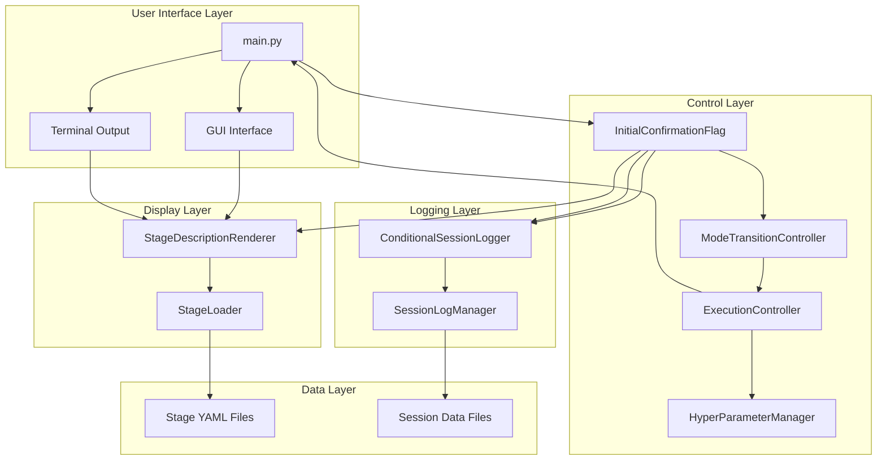
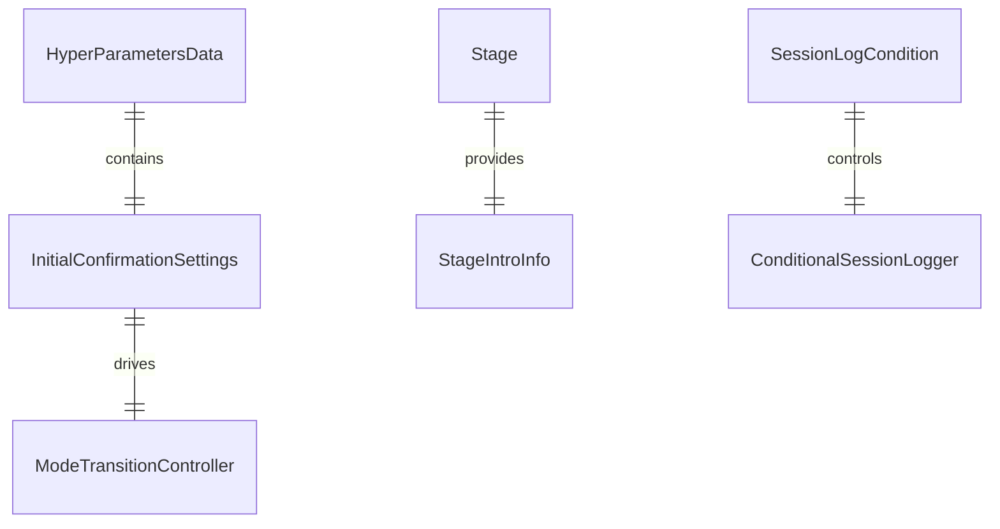
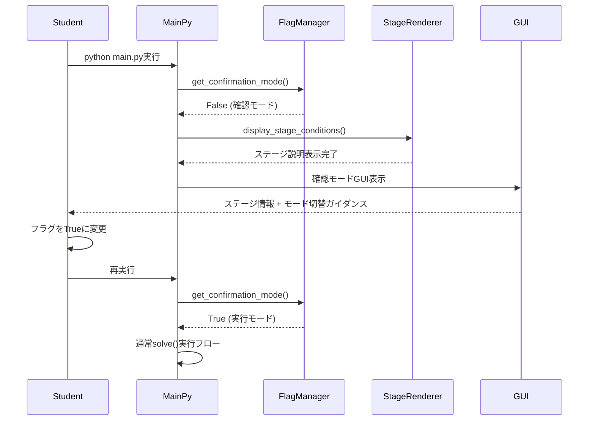
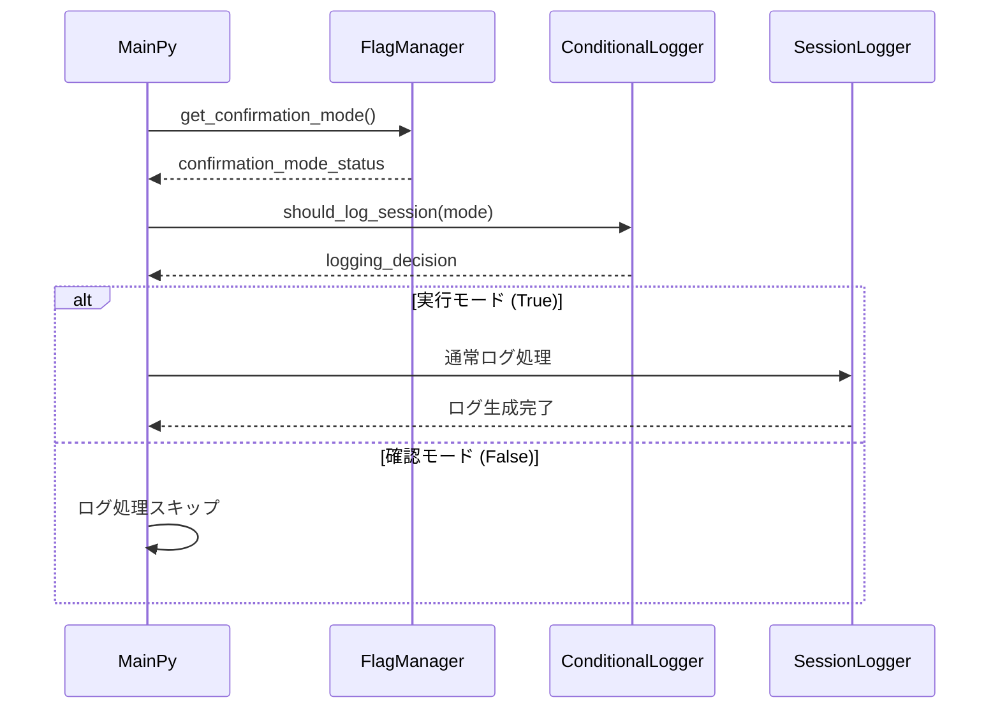

# Technical Design

## Overview

v1.2.4初回起動時動作改善機能は、既存の教育用ローグライクフレームワークに「初回確認モード」を導入し、学習者が新しいステージに取り組む際の学習フローを最適化します。この機能により、学習者は「ステージ理解→コード記述→実行確認」という教育的に望ましい流れを自然に体験できるようになります。

技術的には、既存のHyperParameterManagerシステムに新しいフラグ管理機能を統合し、ExecutionControllerとSessionLogManager、StageLoaderとの連携により、シームレスな体験を提供します。

## Requirements Mapping

### Design Component Traceability
各設計コンポーネントが特定の要件に対応：

- **InitialConfirmationFlag管理** → 1.1-1.4: 初回確認モードフラグ管理機能
- **StageDescriptionRenderer** → 2.1-2.5: ステージ条件表示機能  
- **ConditionalSessionLogger** → 3.1-3.5: セッションログ除外機能
- **ModeTransitionController** → 4.1-4.4: モード遷移制御機能
- **ConfirmationModeGUI** → 5.1-5.5: GUI表示制御機能
- **HyperParameterIntegration** → 6.1-6.5: ハイパーパラメータ統合機能

### User Story Coverage
要件から設計への対応：

- **学習者のステージ理解ニーズ**: InitialConfirmationFlag + StageDescriptionRendererで対応
- **教員のデータ分離ニーズ**: ConditionalSessionLoggerによる条件的ログ生成で対応
- **学習者のスムーズ遷移ニーズ**: ModeTransitionController + 既存ExecutionControllerで対応
- **システム開発者の整合性ニーズ**: HyperParameterIntegrationによる既存システム統合で対応

## Architecture



### Technology Stack
既存の技術スタックを活用し、最小限の拡張で実装：

- **言語**: Python 3.8+ (既存)
- **GUI Framework**: pygame (既存v1.2.3)
- **データ処理**: 標準ライブラリ + YAML (既存)
- **ログ管理**: 既存SessionLogManagerシステム
- **テストフレームワーク**: pytest (既存)

### Architecture Decision Rationale

**既存システム統合の理由**:
- HyperParameterManagerへの統合により、一貫したパラメータ管理を維持
- ExecutionControllerとの連携により、既存のGUIボタン機能を活用
- StageLoaderの拡張により、既存のYAMLステージ定義を最大限活用

**条件的ログ生成の採用理由**:
- 既存SessionLogManagerの機能を保持しつつ、確認モード時のみログ除外を実現
- 教育データの整合性を保ちながら、学習活動と評価活動を明確に分離

## Components and Interfaces

### Backend Services & Method Signatures

#### InitialConfirmationFlagManager
```python
class InitialConfirmationFlagManager:
    def __init__(self, hyperparameter_manager: HyperParameterManager):
        """既存ハイパーパラメータシステムと統合"""
        
    def get_confirmation_mode(self) -> bool:
        """初回確認モードフラグの取得"""
        
    def set_confirmation_mode(self, enabled: bool) -> None:
        """初回確認モードフラグの設定"""
        
    def is_first_execution(self, stage_id: str, student_id: str) -> bool:
        """指定ステージの初回実行判定"""
```

#### StageDescriptionRenderer
```python
class StageDescriptionRenderer:
    def __init__(self, stage_loader: StageLoader):
        """既存ステージローダーと統合"""
        
    def display_stage_conditions(self, stage: Stage) -> None:
        """ステージクリア条件の整形表示"""
        
    def format_description_text(self, description: str) -> str:
        """説明文の可読性向上フォーマット"""
        
    def display_fallback_message(self, stage_id: str) -> None:
        """description未設定時のフォールバック表示"""
```

#### ConditionalSessionLogger
```python
class ConditionalSessionLogger:
    def __init__(self, session_log_manager: SessionLogManager):
        """既存ログマネージャーとの統合"""
        
    def should_log_session(self, confirmation_mode: bool) -> bool:
        """セッションログ生成条件の判定"""
        
    def conditional_log_start(self, **kwargs) -> Optional[str]:
        """条件付きセッション開始ログ"""
        
    def conditional_log_end(self, **kwargs) -> None:
        """条件付きセッション終了ログ"""
```

### Frontend Components (GUI Integration)

| Component | Responsibility | Integration Point |
|-----------|---------------|-------------------|
| ConfirmationModeOverlay | 確認モード時のGUI表示制御 | 既存pygame.Surface |
| StatusIndicator | 現在のモード状態表示 | 既存GUI info panel |
| ModeTransitionHint | モード切替ガイダンス表示 | Terminal + GUI |

### API Endpoints (Internal)
内部API拡張点：

| Method | Module | Purpose | Integration |
|--------|--------|---------|-------------|
| setup_confirmation_mode | main.py | 確認モード初期化 | HyperParameterManager |
| display_stage_intro | main.py | ステージ説明表示 | StageDescriptionRenderer |
| check_logging_condition | main.py | ログ生成判定 | ConditionalSessionLogger |

## Data Models

### Domain Entities
1. **InitialConfirmationSettings**: 確認モード設定データ
2. **StageIntroInfo**: ステージ説明情報
3. **SessionLogCondition**: ログ生成条件

### Entity Relationships


### Data Model Definitions

```python
@dataclass
class InitialConfirmationSettings:
    """初回確認モード設定データ"""
    confirmation_mode_enabled: bool = False  # デフォルトは確認モード
    stage_intro_shown: bool = False
    last_checked_stage: Optional[str] = None
    mode_transition_timestamp: Optional[datetime] = None

@dataclass  
class StageIntroInfo:
    """ステージ説明情報"""
    stage_id: str
    description: str
    formatted_description: str
    has_custom_description: bool
    display_timestamp: datetime

@dataclass
class SessionLogCondition:
    """セッションログ生成条件"""
    should_log: bool
    confirmation_mode: bool
    reasoning: str
    student_id: str
    stage_id: str
```

### HyperParametersData Extension
既存のHyperParametersDataクラスを拡張：

```python
@dataclass
class HyperParametersData:
    """拡張版ハイパーパラメータデータ"""
    stage_id: str = "stage01"
    student_id: Optional[str] = None
    log_enabled: bool = True
    
    # v1.2.4新機能
    initial_confirmation_mode: bool = False  # False=確認モード, True=実行モード
    stage_intro_displayed: Dict[str, bool] = field(default_factory=dict)
```

### Configuration Changes
config.py への設定追加：

```python
# v1.2.4 Initial Confirmation Mode Settings
INITIAL_CONFIRMATION_MODE_DEFAULT = False  # デフォルトは確認モード
STAGE_DESCRIPTION_MAX_WIDTH = 80  # ターミナル表示幅
CONFIRMATION_MODE_GUI_OVERLAY = True  # GUI確認モード表示
```

## Data Flow

### Primary User Flows

#### 1. 初回確認モード実行フロー


#### 2. セッションログ条件判定フロー


### Modified Execution Flow
main.py の実行フロー変更：

```python
def main():
    # 既存のハイパーパラメータ設定
    hyperparameter_manager.load_from_config(config)
    
    # 🆕 v1.2.4: 初回確認モード判定
    flag_manager = InitialConfirmationFlagManager(hyperparameter_manager)
    
    if not flag_manager.get_confirmation_mode():
        # 確認モード: ステージ説明表示のみ
        stage_renderer = StageDescriptionRenderer(stage_loader)
        stage = stage_loader.load_stage(hyperparameter_manager.data.stage_id)
        stage_renderer.display_stage_conditions(stage)
        
        # セッションログ除外
        print("👆 ステージ条件を確認後、フラグをTrueに変更して再実行してください")
        return
    else:
        # 実行モード: 通常のsolve()実行
        # 既存の実行フロー継続
        # セッションログ生成
```

## Error Handling

### エラー処理戦略

```python
class InitialConfirmationModeError(Exception):
    """初回確認モード関連エラー"""
    pass

class StageDescriptionError(Exception):
    """ステージ説明表示エラー"""  
    pass

# エラーハンドリング実装例
try:
    stage_renderer.display_stage_conditions(stage)
except StageDescriptionError as e:
    logger.warning(f"ステージ説明表示エラー: {e}")
    stage_renderer.display_fallback_message(stage.id)
except Exception as e:
    logger.error(f"予期しないエラー: {e}")
    print("❌ ステージ情報の表示中にエラーが発生しました")
    print("💡 main.py内のフラグをTrueに設定して通常モードで実行してください")
```

### Graceful Degradation
- ステージ説明表示失敗時: フォールバックメッセージ表示
- フラグ設定エラー時: デフォルト確認モードで継続
- GUI表示エラー時: ターミナル表示にフォールバック

## Performance & Scalability

### Performance Targets
| Metric | Target | Measurement |
|--------|--------|-------------|
| フラグ判定時間 | < 1ms | 処理時間計測 |
| ステージ説明表示 | < 50ms | レンダリング時間 |
| モード遷移時間 | < 10ms | 状態変更時間 |

### Caching Strategy
- **ステージ説明キャッシュ**: 同一ステージの説明文をメモリキャッシュ
- **フラグ状態キャッシュ**: HyperParameterManager内でフラグ状態保持

### Memory Usage
新機能による追加メモリ使用量: < 1MB (ステージ説明キャッシュ含む)

## Testing Strategy

### Risk Matrix
| Area | Risk | Must | Optional | Ref |
|---|---|---|---|---|
| フラグ管理 | M | Unit, Integration | Performance | 1.1-1.4 |
| ステージ説明表示 | L | Unit, Integration | GUI | 2.1-2.5 |
| ログ除外機能 | H | Unit, Integration | Data Integrity | 3.1-3.5 |
| モード遷移 | M | Unit, E2E | UX | 4.1-4.4 |
| GUI統合 | M | Integration, E2E | Visual | 5.1-5.5 |

### Test Strategy by Layer

#### Unit Tests
```python
# test_initial_confirmation_flag.py
class TestInitialConfirmationFlag:
    def test_default_confirmation_mode_false(self):
        """初期値がFalseであることを確認"""
        
    def test_flag_transition_functionality(self):
        """フラグ遷移機能のテスト"""
        
    def test_hyperparameter_integration(self):
        """ハイパーパラメータ統合テスト"""

# test_stage_description_renderer.py  
class TestStageDescriptionRenderer:
    def test_description_formatting(self):
        """説明文フォーマット機能"""
        
    def test_fallback_message_display(self):
        """フォールバックメッセージ表示"""

# test_conditional_session_logger.py
class TestConditionalSessionLogger:
    def test_logging_exclusion_in_confirmation_mode(self):
        """確認モード時のログ除外"""
        
    def test_normal_logging_in_execution_mode(self):
        """実行モード時の通常ログ"""
```

#### Integration Tests
```python
# test_initial_execution_behavior_integration.py
class TestInitialExecutionBehaviorIntegration:
    def test_full_confirmation_mode_flow(self):
        """確認モード全体フローテスト"""
        
    def test_mode_transition_integration(self):
        """モード遷移統合テスト"""
        
    def test_session_logging_integration(self):
        """セッションログ統合テスト"""
```

#### E2E Tests  
```python
# test_e2e_initial_execution.py
class TestE2EInitialExecution:
    def test_student_first_time_experience(self):
        """学生初回体験の完全フロー"""
        
    def test_mode_switching_workflow(self):
        """モード切替ワークフロー"""
```

### CI Gates
| Stage | Run | Gate | SLA |
|---|---|---|---|
| PR | Unit + Integration | Fail = block | ≤2m |
| Staging | E2E + GUI | Fail = block | ≤5m |
| Nightly | Performance | Regression → issue | - |

### Exit Criteria
- すべてのEARS要件に対応するテストが成功
- 既存機能に影響がないことを確認（回帰テスト）
- 確認モード→実行モード遷移が正常動作
- セッションログ除外機能が正確に動作