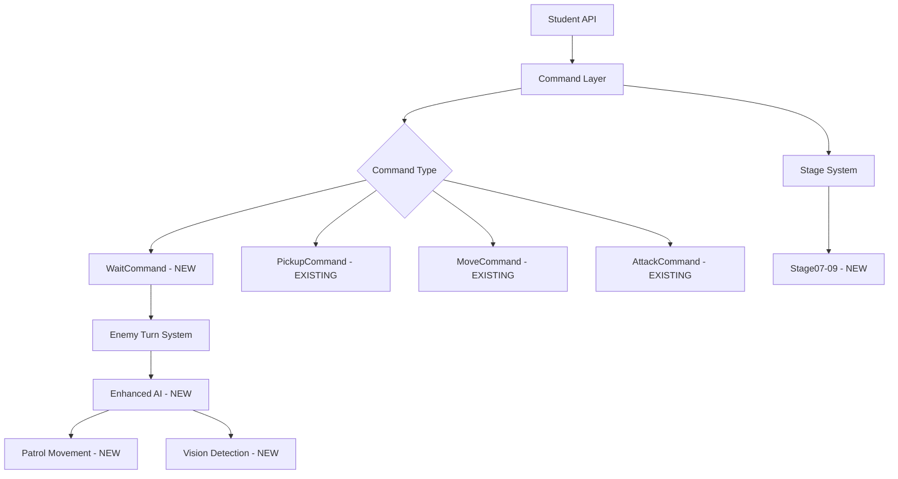

# Technical Design

## Overview

v1.2.7では、既存のゲームエンジンにpickup機能とwait機能を統合し、stage07-09を実装する。研究結果により、pickup機能は既に実装済みであることが判明したため、主な実装焦点はWaitCommand実装と新ステージ設計、および敵AI移動パターンの拡張となる。

## Requirements Mapping

### Design Component Traceability
各設計コンポーネントと要件の対応関係：

- **WaitCommand** → 2.1-2.5: wait()関数実装とターン制御
- **Enhanced Enemy AI** → 5.1-5.5: 敵AI移動ルーチンと視界システム
- **Stage07-09 YAML Definitions** → 3.1-3.5, 4.1-4.5: 新ステージ実装
- **Game Balance Controller** → 6.1-6.5: バランス調整システム
- **Session Logging Enhancement** → 8.1: pickup初回使用記録

### User Story Coverage
- **Python初学者のpickup学習**: 既存PickupCommand活用
- **wait戦術的学習**: 新WaitCommand実装
- **武器取得戦略学習**: stage07設定による実現
- **ループ処理学習**: stage08拡大レイアウト
- **動的AI相互作用**: stage09移動AI実装

## Architecture

### Current System Integration
既存のCommand Pattern、Enemy System、Item Systemを活用し、最小限の変更で新機能を統合する。



### Technology Stack
既存技術スタック継続使用：

- **Language**: Python 3.8+
- **Game Engine**: pygame (GUI)  
- **Configuration**: YAML (stage definitions)
- **Data Processing**: JSON (session logging)
- **Architecture**: Command Pattern + State Machine
- **Testing**: pytest framework

### Simple Logic Principle
変数重複設定問題を回避するため、Single Source of Truth原則を適用：

- **Player Stats**: game_state.player のみで管理
- **Enemy States**: 各enemy.current_state のみで管理  
- **Stage Config**: YAMLファイルのみを信頼できる情報源とする
- **Turn Management**: 一元化されたturn_managerで制御

## Components and Interfaces

### Backend Services & Method Signatures

#### WaitCommand Implementation
```python
class WaitCommand(Command):
    def execute(self, game_state: GameState) -> ExecutionResult:  # プレイヤーターン消費、敵ターン実行
    def undo(self, game_state: GameState) -> bool:              # 取り消し不可
    def can_undo(self) -> bool:                                 # False返却
    def get_description(self) -> str:                           # "1ターン待機"
```

#### Enhanced Enemy AI Extensions
```python
class PatrolMovementAI:
    def __init__(self, patrol_path: List[Position]):             # 巡回経路設定
    def get_next_move(self, enemy: Enemy) -> Position:           # 次移動先計算
    def detect_player(self, enemy: Enemy, player: Position) -> bool:  # プレイヤー検出
    def switch_to_chase_mode(self, enemy: Enemy) -> None:        # 追跡モード切替
```

#### Stage Configuration Manager
```python
class StageConfigManager:
    def load_stage_balance(self, stage_id: str) -> Dict[str, int]:    # バランス設定読込
    def apply_enemy_scaling(self, enemies: List[Enemy], config: Dict): # 敵強化適用
    def validate_stage_requirements(self, stage_id: str) -> bool:      # ステージ要件検証
```

### API Endpoints
学生向けAPI拡張：

| Function | Purpose | Parameters | Return | Error Handling |
|----------|---------|------------|--------|----------------|
| wait() | 1ターン待機 | None | ExecutionResult | 教育的エラーメッセージ |
| pickup() | アイテム取得 | None | PickupResult | 既存エラーハンドリング継続 |
| see() | 状況確認拡張 | None | Dict (items, enemies, vision) | 情報取得失敗時の対応 |

## Data Models

### Domain Entities

#### WaitResult (ExecutionResult拡張)
```python
@dataclass  
class WaitResult(ExecutionResult):
    enemy_actions_executed: List[str] = None  # 敵が実行したアクション
    turn_consumed: bool = True                # ターン消費確認
```

#### Enhanced Enemy State
```python
@dataclass
class EnemyMovementState:
    patrol_index: int = 0                     # 巡回位置インデックス
    vision_range: int = 2                     # 視界範囲
    last_player_position: Optional[Position] = None  # 最後に見たプレイヤー位置
    movement_mode: str = "patrol"             # "patrol" or "chase"
```

### Stage Configuration Schema
```yaml
# stage07.yml example
id: stage07
enemies:
  - id: "strong_goblin"
    hp: 60          # プレイヤー攻撃30では2回必要
    attack: 31      # プレイヤーHP30を1撃で撃破
    behavior: "static"
    
weapons:           # NEW section
  - id: "sword"
    position: [1, 1] 
    auto_equip: true
    effect:
      attack: 35   # 装備後65攻撃力で敵1撃撃破可能
```

### Database Schema
セッションログ拡張：

```json
{
  "session_id": "uuid",
  "pickup_actions": [
    {
      "timestamp": "2025-09-10T16:00:00Z",
      "item_name": "sword",
      "first_pickup": true
    }
  ],
  "wait_actions": [
    {
      "timestamp": "2025-09-10T16:01:00Z", 
      "enemy_responses": ["goblin_turn", "goblin_attack"]
    }
  ]
}
```

## Error Handling

### Educational Error Messages
シンプルで理解しやすいエラーメッセージを提供：

```python
ERROR_MESSAGES = {
    "wait_no_effect": "待機しましたが、周囲に敵がいないため何も起こりませんでした",
    "pickup_no_item": "ここにはアイテムがありません。see()で周囲を確認してください",
    "stage_api_restricted": "この機能は現在のステージでは使用できません"
}
```

### Simple Error Recovery
複雑な状態管理を避け、シンプルな回復処理：

1. エラー発生時は前の安定状態に戻す
2. 複数箇所での状態変更を避け、一箇所で管理
3. デバッグ用の状態ダンプ機能提供

## Performance & Scalability

### Performance Targets
| Metric | Target | Measurement |
|--------|--------|-------------|
| Command Execution | < 50ms | WaitCommand処理時間 |
| Enemy AI Decision | < 100ms | PatrolMovementAI計算 |
| Stage Loading | < 200ms | YAML parsing + validation |
| Session Log Write | < 10ms | JSON serialization |

### Simple State Management
パフォーマンス問題を避けるため：

- Enemy AI状態をメモリ効率的に管理
- Stage設定のキャッシュ化
- 不要な状態複製を避ける

## Testing Strategy

### Risk Matrix
| Area | Risk | Must | Optional | Ref |
|------|------|------|----------|-----|
| WaitCommand | M | Unit, Integration | E2E | 2.1-2.5 |
| Enemy AI | H | Unit, Property | AI Behavior | 5.1-5.5 |
| Stage Balance | H | Integration | Manual | 6.1-6.5 |
| API Integration | L | Contract | Regression | 7.1-7.5 |

### Test Implementation Plan

#### Unit Tests
```python
# tests/test_wait_command.py
def test_wait_command_execution():
    """WaitCommand基本実行テスト"""
    
def test_wait_with_adjacent_enemy():
    """隣接敵がいる場合のwait動作テスト"""
    
def test_wait_enemy_ai_response():
    """敵AIの標準動作実行確認テスト"""
```

#### Integration Tests  
```python
# tests/test_stage07_integration.py
def test_stage07_weapon_pickup_victory():
    """武器取得→攻撃→勝利フローテスト"""
    
def test_stage07_no_weapon_defeat():
    """武器未取得→攻撃→敗北フローテスト"""
```

#### Stage-specific Tests
```python
# tests/test_enemy_ai_movement.py  
def test_patrol_movement_cycle():
    """巡回AI移動サイクルテスト"""
    
def test_player_detection_chase():
    """プレイヤー検出→追跡モード切替テスト"""
```

### CI Gates
| Stage | Run | Gate | SLA |
|-------|-----|------|-----|
| PR | Unit + Contract | Fail = block | ≤3min |
| Staging | Integration + E2E | Fail = block | ≤5min |
| Manual | Stage Balance Testing | Regression → issue | - |

### Exit Criteria
- すべての要件のEARS基準が満たされている
- 既存機能の回帰テストが通過している  
- 新ステージが教育目標を達成している
- パフォーマンス目標値を満たしている

## Implementation Strategy

### Phase 1: Core Command Implementation (1 day)
1. WaitCommandクラス実装
2. Enemy turn executionロジック統合
3. 基本的なunit tests作成

### Phase 2: Enemy AI Enhancement (2 days)  
1. PatrolMovementAI実装
2. Vision detection system追加
3. Chase mode switching logic
4. AI behavior tests

### Phase 3: Stage Configuration (2 days)
1. stage07.yml作成・テスト
2. stage08.yml作成・テスト  
3. stage09.yml作成・テスト
4. Balance adjustment validation

### Phase 4: Integration & Testing (1 day)
1. 統合テスト実行
2. 教育効果検証
3. Performance optimization
4. Documentation update

## Security Considerations

### Input Validation
- ステージ設定の妥当性検証
- 敵AI行動の範囲制限
- セッションログのデータサニタイゼーション

### Educational Safety
- 無限ループ検出（既存機能継続）
- 適切なエラーメッセージによる学習阻害防止
- セッション情報の適切な匿名化

## Notes

### Avoiding Variable Conflicts
設計において以下の原則を適用し、変数の重複設定問題を回避：

1. **Single Source of Truth**: 各状態変数は一箇所でのみ管理
2. **Immutable Configuration**: YAML設定は読み込み後変更不可
3. **Clear Ownership**: 各クラスが管理する変数を明確に定義
4. **Simple State Transitions**: 複雑な状態遷移を避け、予測可能な動作を保証

### Implementation Priority
既存システムとの互換性を最優先し、段階的な機能追加を行う。特にPickupCommandは既実装のため、統合テストに重点を置く。