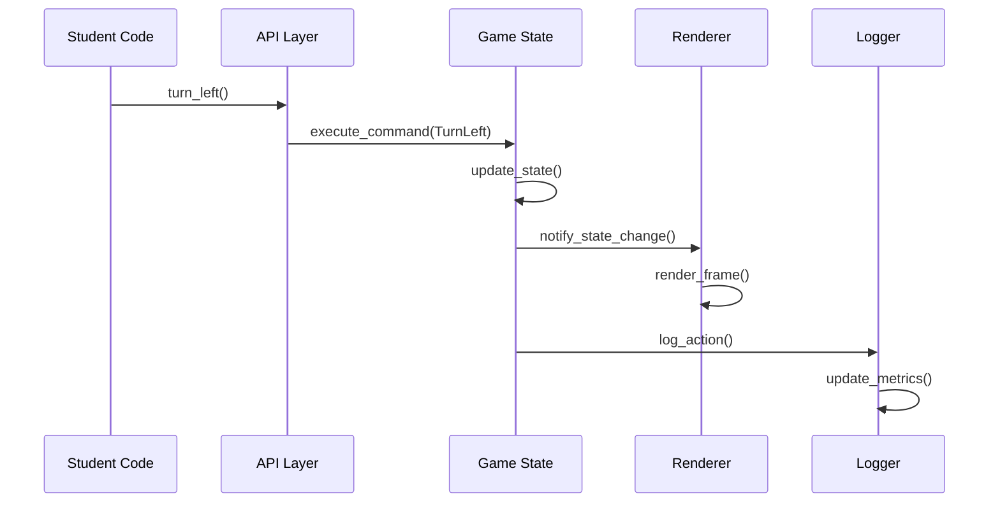
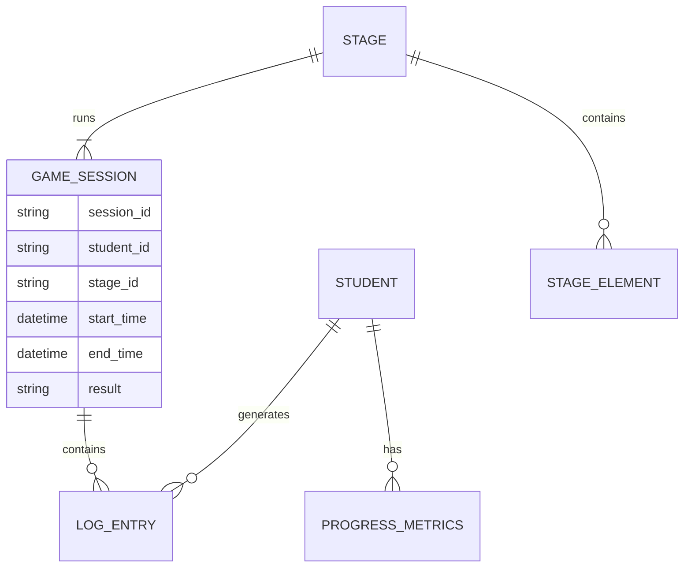

# Technical Design

## Overview
Python初学者向けローグライク演習フレームワークは、研究結果に基づく教育効果の高いゲームベース学習環境を提供します。ステートマシンベースのアーキテクチャとMVCパターンを採用し、段階的学習とデュアル表示システムを実現します。YAML駆動の設定により教員は柔軟にステージを設計でき、包括的な進捗追跡により学習効果を最大化します。

## Requirements Mapping

### Design Component Traceability
各設計コンポーネントは具体的な要件に対応します：

- **GameStateManager** → 1.1, 1.3, 1.4: ゲーム状態管理と実行制御
- **APILayer** → 2.1-2.7: 学生向けAPI関数の実装
- **StageLoader + YAMLParser** → 3.1-3.7: ステージ定義の読み込みとバリデーション
- **ProgressionManager** → 4.1-4.7: 段階的学習制御
- **RendererFactory + GuiRenderer/CuiRenderer** → 5.1-5.6: デュアル表示システム
- **Logger + ProgressAnalyzer** → 6.1-6.7: 進捗追跡と品質評価
- **DataUploader** → 7.1-7.6: Google Sheets連携
- **ConfigManager** → 8.1-8.6: 環境構築支援
- **StageGenerator** → 9.1-9.5: ランダムステージ生成
- **ErrorHandler + EducationalFeedback** → 10.1-10.5: 教育的エラーハンドリング

### User Story Coverage
全てのユーザーストーリーが技術設計で対応されています：

- **教育者向け**: 安定実行環境、柔軟ステージ設計、進捗把握、環境配布
- **学生向け**: 直感的API、段階的学習、視覚的フィードバック、エラー学習

## Architecture

```mermaid
graph TB
    A[Student Code - solve()] --> B[API Layer]
    B --> C[Command System]
    C --> D[Game State Manager]
    D --> E[Stage Manager]
    D --> F[Progression Manager]
    D --> G[Renderer Factory]
    G --> H[GUI Renderer - pygame]
    G --> I[CUI Renderer - text]
    D --> J[Logger]
    J --> K[Progress Analyzer]
    K --> L[Data Uploader]
    L --> M[Google Sheets]
    E --> N[YAML Parser]
    N --> O[Stage Validator]
    P[Error Handler] --> Q[Educational Feedback]
    D --> P
```

### Technology Stack
研究調査に基づく最適な技術選択：

- **Core Language**: Python 3.8+ (教育環境での安定性)
- **Game Engine**: pygame 2.5+ (教育用2Dゲームの標準)
- **Configuration**: PyYAML 6.0+ (データ駆動設計)
- **Data Processing**: 標準ライブラリ (json, csv, hashlib)
- **API Integration**: requests 2.31+ (Google Sheets連携)
- **Testing**: pytest 7.4+ + unittest (教育コード検証)
- **Environment**: conda + pip (学習効果重視の手動セットアップ)

### Architecture Decision Rationale
研究結果に基づく設計決定の根拠：

- **Why State Machine Pattern**: ゲームプログラミングパターンの研究により、状態管理の複雑さを制御し教育的な構造を強制
- **Why MVC + Observer Pattern**: pygame教育アプリケーションでの推奨パターン、GUI/CUI同期レンダリングを実現
- **Why YAML Configuration**: データ駆動設計により教員のステージ編集を可能にし、コード変更なしでの機能拡張を実現
- **Why Progressive Disclosure**: 教育研究で実証済みの段階的機能開示により学習効果を最大化
- **Why Command Pattern**: 学生アクションの統一的処理とundo機能の基盤を提供

### Data Flow
システム内データフローの詳細：



## Components and Interfaces

### Backend Services & Method Signatures

```python
class GameStateManager:
    def initialize_game(self, stage_id: str) -> GameState:
        """ゲーム状態を初期化し実行を開始"""
    
    def execute_command(self, command: Command) -> ExecutionResult:
        """コマンドを実行し結果を返す"""
    
    def get_current_state(self) -> GameState:
        """現在のゲーム状態を取得"""
    
    def is_game_finished(self) -> bool:
        """ゲーム終了状態の判定"""

class APILayer:
    def turn_left(self) -> None:
        """キャラクターを左に90度回転"""
    
    def turn_right(self) -> None:
        """キャラクターを右に90度回転"""
    
    def move(self) -> bool:
        """正面方向に1マス移動、成功時True"""
    
    def attack(self) -> AttackResult:
        """正面1マスを攻撃"""
    
    def pickup(self) -> PickupResult:
        """足元のアイテムを取得"""
    
    def see(self) -> Dict[str, Any]:
        """周囲の状況情報を取得"""

class StageLoader:
    def load_stage(self, stage_path: Path) -> Stage:
        """YAMLからステージを読み込み"""
    
    def validate_stage(self, stage: Stage) -> ValidationResult:
        """ステージ定義をバリデーション"""
    
    def get_available_stages(self) -> List[StageInfo]:
        """利用可能ステージリストを取得"""

class Logger:
    def start_session(self, student_id: str, stage_id: str) -> None:
        """学習セッション開始"""
    
    def log_action(self, action: Action) -> None:
        """学生アクションをログ記録"""
    
    def end_session(self, result: GameResult) -> LogSummary:
        """セッション終了とサマリー生成"""
    
    def calculate_metrics(self, code: str) -> QualityMetrics:
        """コード品質メトリクス計算"""

class DataUploader:
    def upload_to_sheets(self, log_data: LogData) -> UploadResult:
        """Google Sheetsにデータ送信"""
    
    def check_rate_limit(self) -> bool:
        """レート制限チェック"""
    
    def handle_offline_storage(self, data: LogData) -> None:
        """オフライン時ローカル保存"""
```

### Frontend Components (Renderer System)

| Component | Responsibility | Key Methods |
|-----------|---------------|-------------|
| RendererFactory | 表示モード選択・切替 | create_renderer(mode), switch_mode() |
| GuiRenderer | pygame 2D描画 | render_frame(), draw_character(), draw_grid() |
| CuiRenderer | テキスト表示 | print_game_state(), format_grid() |
| SpriteManager | アセット管理 | load_sprites(), get_sprite() |

### API Endpoints (Development Server - Optional)
将来拡張用のAPI仕様：

| Method | Route | Purpose | Auth | Status Codes |
|--------|-------|---------|------|--------------|
| GET | /api/stages | ステージリスト取得 | Student ID | 200, 401, 500 |
| POST | /api/sessions | セッション開始 | Student ID | 201, 400, 401, 500 |
| PUT | /api/sessions/:id | 進捗更新 | Student ID | 200, 400, 401, 404, 500 |
| GET | /api/progress | 進捗統計取得 | Student ID | 200, 401, 500 |

## Data Models

### Domain Entities
1. **GameState**: 現在のゲーム状況（プレイヤー位置、向き、敵状態、アイテム）
2. **Stage**: ステージ定義（マップ、目標、制約、許可API）
3. **Character**: プレイヤーまたは敵の属性（位置、向き、HP、装備）
4. **LogEntry**: 学習活動記録（アクション、タイムスタンプ、結果）
5. **ProgressMetrics**: 学習進捗評価（試行回数、ターン数、品質指標）

### Entity Relationships


### Data Model Definitions

```python
@dataclass
class GameState:
    player: Character
    enemies: List[Enemy]
    items: List[Item]
    board: Board
    turn_count: int
    max_turns: int
    status: GameStatus

@dataclass  
class Stage:
    id: str
    board_size: Tuple[int, int]
    player_start: Position
    enemies: List[EnemyDefinition]
    items: List[ItemDefinition] 
    goal: Goal
    allowed_apis: List[str]
    constraints: Dict[str, Any]

@dataclass
class LogEntry:
    timestamp: datetime
    student_id: str
    stage_id: str
    action: str
    result: str
    game_state_hash: str
    
@dataclass
class ProgressMetrics:
    student_id: str
    stage_id: str
    attempts: int
    successful_turns: int
    total_turns: int
    code_lines: int
    code_hash: str
    collaborators: List[str]
    late_submission: bool
```

### Database Schema (Local SQLite for Development)

```sql
CREATE TABLE students (
    student_id VARCHAR(7) PRIMARY KEY, -- 6桁数字+英大文字1桁
    name VARCHAR(255),
    created_at TIMESTAMP DEFAULT CURRENT_TIMESTAMP
);

CREATE TABLE stages (
    stage_id VARCHAR(20) PRIMARY KEY,
    title VARCHAR(255) NOT NULL,
    difficulty_level INTEGER,
    allowed_apis TEXT, -- JSON配列
    created_at TIMESTAMP DEFAULT CURRENT_TIMESTAMP
);

CREATE TABLE game_sessions (
    session_id VARCHAR(36) PRIMARY KEY,
    student_id VARCHAR(7) REFERENCES students(student_id),
    stage_id VARCHAR(20) REFERENCES stages(stage_id),
    start_time TIMESTAMP DEFAULT CURRENT_TIMESTAMP,
    end_time TIMESTAMP,
    result VARCHAR(20), -- pass/fail/timeout
    turns_used INTEGER,
    attempts INTEGER,
    code_hash VARCHAR(64),
    collaborators TEXT -- カンマ区切り
);
```

### YAML Stage Schema
```yaml
# ステージ定義スキーマ
id: stage01
meta:
  title: "基本移動"
  description: "turn_left, turn_right, moveを使った基本移動"
  difficulty: 1
  
board:
  size: {w: 5, h: 5}
  repr:
    grid: |
      P....
      .....
      ..G..
      .....
      .....
    legend:
      P: player_E  # プレイヤー、東向き
      .: empty
      G: goal
      
constraints:
  max_turns: 10
  time_limit: 300  # 秒
  
api:
  allowed: [turn_left, turn_right, move]
  
validation:
  win_condition: reach_goal
  fail_conditions: [timeout, max_turns_exceeded]
```

## Error Handling

### Educational Error Categories
```python
class EducationalError(Exception):
    """教育目的に特化したエラーベース"""
    
class MovementError(EducationalError):
    """移動関連エラー"""
    # "壁があります。turn_left()で向きを変えてみましょう"
    
class APIUsageError(EducationalError):
    """API使用法エラー"""  
    # "このステージではattack()はまだ使えません"
    
class LogicError(EducationalError):
    """学習ロジックエラー"""
    # "無限ループが発生しています。条件を確認してください"
```

### Error Handler Implementation
```python
class ErrorHandler:
    def handle_error(self, error: Exception, context: GameContext) -> ErrorResponse:
        """エラーを教育的フィードバックに変換"""
        
    def generate_hint(self, error_type: str, stage_context: str) -> str:
        """段階に応じたヒント生成"""
        
    def format_japanese_message(self, error: Exception) -> str:
        """平易な日本語エラーメッセージ"""
```

## Security Considerations

### Educational Environment Security
- **データ保護**: 学籍番号のハッシュ化オプション（設定可能）
- **コード安全性**: importフィルタリング、危険関数制限
- **リソース制限**: 実行時間・メモリ・CPU使用量制限
- **ネットワーク制限**: Google Sheets以外の外部通信ブロック
- **ログ保護**: 個人情報を含むログの暗号化保存

## Performance & Scalability

### Performance Targets
| Metric | Target | Measurement |
|--------|--------|-------------|
| ターン実行時間 (p95) | < 100ms | API応答時間 |
| ステージ読み込み (p99) | < 200ms | YAML解析時間 |
| 描画フレームレート | 30+ FPS | pygame描画 |
| メモリ使用量 | < 100MB | プロセス監視 |
| 同時セッション数 | > 50 | クラス規模対応 |

### Caching Strategy  
- **ステージキャッシュ**: 解析済みYAMLをメモリ保持
- **スプライトキャッシュ**: pygame画像アセット事前読み込み
- **ログバッファ**: バッチ処理による性能向上
- **進捗キャッシュ**: 学習メトリクス計算結果の保持

### Scalability Approach
- **ローカル実行**: 各学生PCでの独立動作
- **バッチログ処理**: 複数ログの一括アップロード  
- **非同期I/O**: ネットワーク処理の非ブロッキング実行
- **リソースプール**: pygame サーフェス・フォントの再利用

## Testing Strategy

### Risk Matrix
| Area | Risk | Must | Optional | Ref |
|---|---|---|---|---|
| Student API | H | Unit, Integration | Property | 2.1-2.7 |
| Stage Loading | M | Unit, Contract | Schema Validation | 3.1-3.7 |
| Progress Tracking | H | Unit, E2E | Data Integrity | 6.1-6.7 |
| Error Handling | M | Unit, Integration | Accessibility | 10.1-10.5 |
| Dual Rendering | L | Integration | Visual Regression | 5.1-5.6 |

### Minimal by Layer
- **Unit**: API関数・ゲームロジック・エラーハンドリング
- **Integration**: YAML読み込み・ログ出力・Google Sheets連携
- **E2E**: 学生の典型的学習フロー（3パターン）

### CI Gates
| Stage | Run | Gate | SLA |
|---|---|---|---|
| PR | Unit + YAML Validation | Fail = block | ≤2m |
| Release | Integration + E2E | Fail = block | ≤5m |
| Nightly | Performance + Load | Regression → issue | - |

### Educational Code Testing
```python
class StudentCodeTester:
    def test_common_mistakes(self, code: str) -> List[Suggestion]:
        """よくある間違いパターンの検出"""
        
    def validate_api_usage(self, code: str, allowed_apis: List[str]) -> bool:
        """許可されたAPI範囲内での実装確認"""
        
    def detect_infinite_loops(self, code: str) -> bool:
        """無限ループの静的検出"""
```

### Exit Criteria
- 全必須テストがPass（Sev1/Sev2 = 0）
- 教育シナリオの動作確認完了
- パフォーマンス目標値達成
- 学生向けエラーメッセージの可読性確認