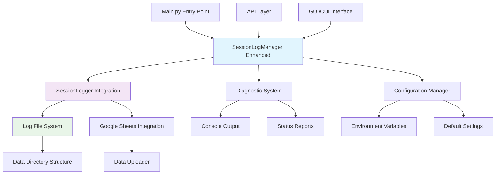
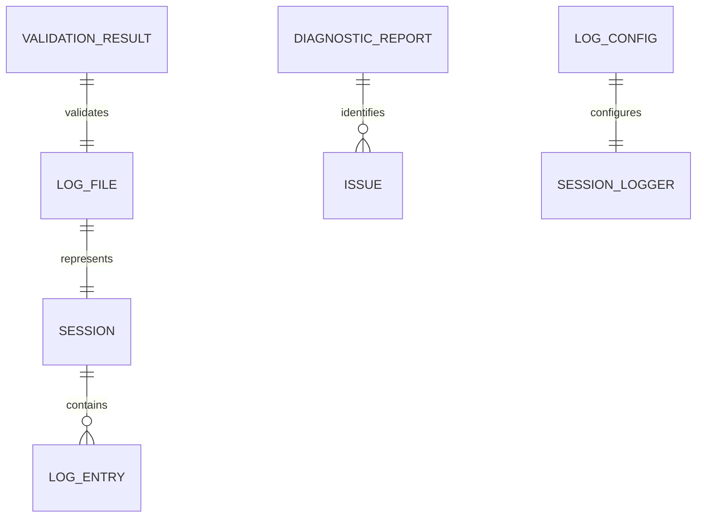

# Technical Design

## Overview

v1.2.2セッションログ機能改善では、現在の「簡易版」実装を本格的なログ生成システムに拡張し、教育現場での確実な学習データ収集を実現します。既存の`SessionLogger`と`SessionLogManager`を統合し、デフォルトでのログ生成、診断機能、アクセス性向上を提供します。

## Requirements Mapping

### Design Component Traceability
各設計コンポーネントは具体的な要件に対応しています：
- **ログ診断システム** → 1.1-1.5: システム起動時の状況確認・報告要件
- **デフォルトログ生成機能** → 2.1-2.5: 自動ログ生成・エラー処理要件
- **ログアクセス管理** → 3.1-3.5: ファイルアクセス・表示・参照要件
- **テスト・バリデーション機能** → 4.1-4.5: テスト・整合性・復旧要件
- **設定管理システム** → 5.1-5.5: カスタマイズ・環境変数・同期要件

### User Story Coverage
- **システム管理者**: 診断機能により現在のログ状況を正確に把握可能
- **学生**: 特別設定不要でデフォルトログ生成、進捗確認が容易
- **教員**: 簡単なログアクセス・確認で個別指導・評価を効率化
- **開発者**: 包括的テスト機能により品質保証・デバッグを支援

## Architecture



### Technology Stack
既存技術スタックとの統合を重視した設計：

- **Backend Language**: Python 3.8+ (既存環境維持)
- **Logging Framework**: Python標準logging + 既存SessionLogger拡張
- **File System**: pathlib (既存config.pyと統合)
- **Data Format**: JSONL (既存形式維持、CSV対応追加)
- **Integration**: Google Sheets API (既存data_uploader活用)
- **Configuration**: 環境変数 + config.py拡張

### Architecture Decision Rationale
技術選択の根拠：

- **既存SessionLoggerを活用**: 新規開発コスト削減、テスト済み機能の活用
- **段階的有効化アプローチ**: GUI動作に影響を与えない安全な実装
- **設定ベース制御**: 教育現場での柔軟な運用に対応
- **診断機能優先**: 問題特定と解決を効率化
- **後方互換性維持**: 既存学生コードへの影響を最小化

## Components and Interfaces

### Backend Services & Method Signatures

#### Enhanced SessionLogManager
```python
class SessionLogManager:
    def enable_default_logging(self, student_id: str, stage_id: str, force_enable: bool = True) -> LogResult
    def diagnose_logging_system(self) -> DiagnosticReport
    def show_log_info(self) -> List[LogFileInfo]
    def get_latest_log_path(self) -> Optional[Path]
    def configure_logging(self, config: LogConfig) -> bool
    def test_session_logging(self) -> TestResult
    def validate_log_integrity(self, log_path: Path) -> ValidationResult
```

#### Log Diagnostic Service
```python
class LogDiagnosticService:
    def check_log_directories(self) -> DirectoryStatus
    def check_session_logger_status(self) -> SessionLoggerStatus
    def verify_permissions(self) -> PermissionStatus
    def generate_diagnostic_report(self) -> DiagnosticReport
```

#### Log Access Service  
```python
class LogAccessService:
    def list_available_logs(self, student_id: Optional[str] = None) -> List[LogFileInfo]
    def format_log_display(self, log_path: Path) -> FormattedLogContent
    def export_logs(self, export_format: str, filter_criteria: dict) -> Path
```

### API Integration Points

#### main.py Integration
```python
# Enhanced initialization flow
def initialize_logging_system():
    log_manager = SessionLogManager()
    diagnostic_report = log_manager.diagnose_logging_system()
    
    if diagnostic_report.has_issues():
        print("⚠️  ログシステム診断結果:")
        print(diagnostic_report.format_report())
    
    # Force enable default logging
    result = log_manager.enable_default_logging(
        student_id=get_student_id(),
        stage_id="default",
        force_enable=True
    )
    
    if result.success:
        print(f"✅ セッションログが有効化されました: {result.log_path}")
    else:
        print(f"❌ ログ有効化エラー: {result.error_message}")
```

#### API Layer Extensions
```python
# New global functions
def show_log_info() -> None              # Display available log files
def get_current_session_log() -> Path    # Get active log file path
def configure_session_logging(**kwargs) -> bool  # Configure logging
def test_logging_system() -> bool        # Test logging functionality
```

## Data Models

### Domain Entities
1. **LogResult**: ログ操作の結果と状態情報
2. **DiagnosticReport**: システム診断結果とトラブルシューティング情報
3. **LogFileInfo**: ログファイルのメタデータと統計
4. **LogConfig**: ログ設定とカスタマイズオプション
5. **ValidationResult**: ログ整合性検証結果

### Entity Relationships


### Data Model Definitions

```python
from dataclasses import dataclass
from datetime import datetime
from pathlib import Path
from typing import List, Optional, Dict, Any
from enum import Enum

class LogLevel(Enum):
    DEBUG = "debug"
    INFO = "info" 
    WARNING = "warning"
    ERROR = "error"
    CRITICAL = "critical"

@dataclass
class LogResult:
    success: bool
    log_path: Optional[Path]
    error_message: Optional[str]
    session_id: Optional[str]
    
@dataclass  
class DiagnosticReport:
    timestamp: datetime
    session_logger_enabled: bool
    log_directory_exists: bool
    permissions_valid: bool
    issues: List[str]
    recommendations: List[str]
    
    def has_issues(self) -> bool:
        return len(self.issues) > 0
    
    def format_report(self) -> str:
        # Format diagnostic information for console display
        pass

@dataclass
class LogFileInfo:
    file_path: Path
    student_id: str
    session_id: str
    created_at: datetime
    file_size: int
    entry_count: int
    last_modified: datetime

@dataclass
class LogConfig:
    log_level: LogLevel
    output_directory: Path
    file_rotation: bool
    max_file_size: int
    google_sheets_sync: bool
    retention_days: int

@dataclass
class ValidationResult:
    is_valid: bool
    total_entries: int
    corrupted_entries: List[int]
    missing_fields: List[str]
    recommendations: List[str]
```

### File System Structure
```
data/
├── sessions/           # Session log files
│   ├── 20250903_123456_123456A.jsonl
│   ├── 20250903_124512_123456A.jsonl
│   └── system.log      # System diagnostic logs
├── diagnostics/        # Diagnostic reports
│   └── diagnostic_20250903.json
├── exports/           # Exported log files
│   └── student_123456A_export.csv
└── backup/           # Backup logs (rotation)
    └── archived/
```

## Error Handling

### Error Hierarchy
```python
class LoggingSystemError(Exception):
    """Base logging system error"""
    pass

class LogFileAccessError(LoggingSystemError):
    """Log file access/permission error"""
    pass

class LogValidationError(LoggingSystemError):
    """Log validation/integrity error"""
    pass

class ConfigurationError(LoggingSystemError):
    """Configuration/setup error"""
    pass
```

### Error Recovery Strategy
1. **権限エラー**: 代替ディレクトリ作成、ユーザーガイダンス表示
2. **ディスク容量不足**: 古いログの自動削除、警告表示
3. **設定エラー**: デフォルト設定への復帰、エラー詳細ログ
4. **Google Sheets接続エラー**: ローカルログ継続、バックグラウンド再試行

## Security Considerations

- **ファイル権限**: ログディレクトリの適切な権限設定（読み書き制限）
- **データプライバシー**: 学生ID匿名化オプション、機密データフィルタリング
- **アクセス制御**: 教員・学生間でのログアクセス権限分離
- **監査ログ**: システム変更・アクセス履歴の記録

## Performance & Scalability

### Performance Targets
| Metric | Target | Measurement |
|--------|--------|-------------|
| Log Write Time | < 10ms | Per entry |
| Diagnostic Report | < 100ms | System check |
| Log File Access | < 50ms | File open time |
| Memory Usage | < 10MB | Logging overhead |

### Caching Strategy
- **Log File Metadata**: メタデータキャッシュで高速アクセス
- **Diagnostic Status**: 診断結果の短期キャッシュ
- **Configuration**: 設定変更時のみ再読み込み

### File Management
- **ログローテーション**: サイズ制限到達時の自動アーカイブ
- **圧縮**: 古いログファイルのgzip圧縮
- **クリーンアップ**: 保持期間経過後の自動削除

## Testing Strategy

### Risk Matrix
| Area | Risk | Must | Optional | Ref |
|---|---|---|---|---|
| Default Logging | H | Unit, Integration | Load | 2.1-2.5 |
| File I/O Operations | H | Unit, Integration | Resilience | 3.1-3.5 |
| Diagnostic System | M | Unit | Performance | 1.1-1.5 |
| Configuration | M | Unit, Integration | Edge Cases | 5.1-5.5 |
| Google Sheets Sync | L | Contract | Network Resilience | 5.4 |

### Test Implementation
```python
class TestSessionLoggingEnhancement:
    def test_default_logging_enabled(self):
        # Test requirement 2.1: Default log generation
        pass
    
    def test_diagnostic_system(self):
        # Test requirement 1.1-1.5: Diagnostic functionality
        pass
    
    def test_log_file_access(self):
        # Test requirement 3.1-3.5: File access and display
        pass
    
    def test_configuration_management(self):
        # Test requirement 5.1-5.5: Configuration and customization
        pass
    
    def test_error_recovery(self):
        # Test requirement 4.2: Error detection and recovery
        pass
```

### CI Gates
| Stage | Run | Gate | SLA |
|---|---|---|---|
| PR | Unit + Integration | Fail = block | ≤3m |
| Staging | E2E + Config Tests | Fail = block | ≤5m |
| Nightly | Performance Tests | Regression → issue | - |

### Exit Criteria
- すべてのEARS要件の実装完了・テスト通過
- デフォルトログ生成の動作確認
- 教員・学生向けドキュメントの作成
- 既存機能への影響なし（回帰テスト通過）