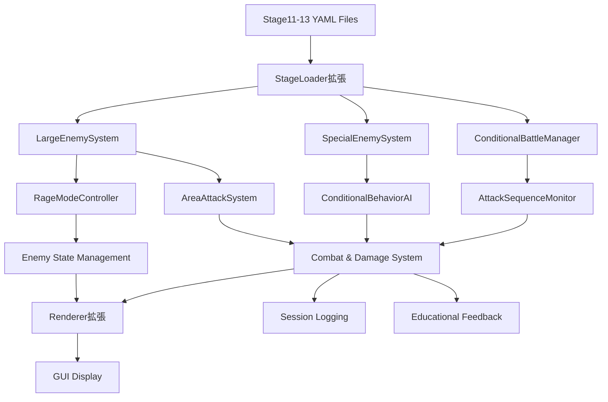
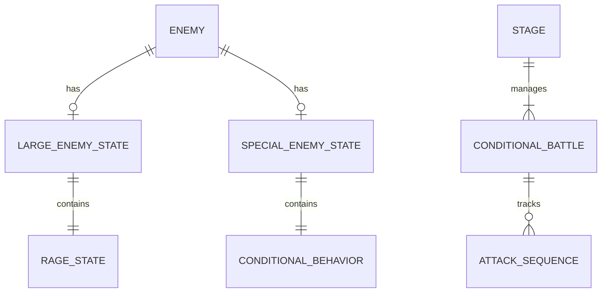

# Technical Design

## Overview
Python初学者向けローグライク演習フレームワークに特殊条件付きステージ（Stage11-13）を追加し、大型敵システム（2x2、3x3）と特殊敵システム（2x3）を実装します。既存のv1.2.7アーキテクチャを拡張し、複雑な戦闘ルール・条件分岐・怒りモード・範囲攻撃システムを統合します。

## Requirements Mapping

### Design Component Traceability
各設計コンポーネントは以下の要件に対応します：
- **LargeEnemySystem（2x2/3x3）** → 1.1-1.8, 2.1-2.5: 大型敵の配置・怒りモード・範囲攻撃システム
- **SpecialEnemySystem（2x3）** → 3.1-3.4: 特殊敵の条件付き行動・追跡攻撃システム
- **Stage11-13 YAML定義** → 4.1-4.4, 5.1-5.3, 6.1-6.4: 各ステージの実装仕様
- **ConditionalBattleManager** → 6.2, 6.4: 特殊条件（攻撃順序）監視システム
- **RageModeController** → 1.4-1.8, 2.4: 怒りモード状態管理・サイクル制御
- **AreaAttackRenderer** → 1.6, 2.5, 4.3: 範囲攻撃の視覚的表示システム

### User Story Coverage
- **学習者の大型敵戦闘体験** → LargeEnemySystem、RageModeController、AreaAttackSystem
- **学習者の特殊条件戦闘体験** → SpecialEnemySystem、ConditionalBattleManager  
- **開発者のシステム統合保持** → 既存APIとの互換性設計、設定一元管理
- **学習者の教育的価値獲得** → 段階的難易度システム、educational feedback統合

## Architecture



### Technology Stack
既存のv1.2.7技術スタックを継承・拡張します：

- **Backend**: Python 3.x（既存）
- **GUI System**: pygame（既存のrenderer.py拡張）
- **Stage Definition**: YAML（既存のstage_loader.py拡張）
- **Enemy AI**: enemy_system.py拡張（BehaviorPattern、EnemyState追加）
- **Data Models**: engine/__init__.py（EnemyType活用、新状態追加）
- **Session Logging**: 既存session_logging.py互換

### Architecture Decision Rationale
既存アーキテクチャとの統合性を最優先とした設計決定：

- **Why 既存enemy_system.py拡張**: 新規システム作成よりも既存AI基盤の活用で安定性確保
- **Why YAML定義拡張**: 既存ステージ定義規則の一貫性保持、学習者混乱防止
- **Why pygame renderer統合**: 既存GUI Enemy Info Panel活用、開発効率向上
- **Why 状態マシン設計**: 怒りモード・平常モードの明確な状態遷移、デバッグ容易性

## Components and Interfaces

### Backend Services & Method Signatures

#### LargeEnemySystem
```python
class LargeEnemySystem:
    def __init__(self, enemy_system: EnemySystem):
        """大型敵システム初期化"""
        
    def initialize_large_enemy(self, enemy: Enemy) -> None:
        """大型敵の初期配置・状態設定"""
        
    def update_rage_state(self, enemy: Enemy) -> bool:
        """怒りモード状態更新、状態変更時Trueを返す"""
        
    def trigger_rage_mode(self, enemy: Enemy) -> None:
        """怒りモード発動（HP50%以下トリガー）"""
        
    def execute_area_attack(self, enemy: Enemy, board) -> List[Position]:
        """範囲攻撃実行、攻撃座標リストを返す"""
        
    def get_area_attack_range(self, enemy: Enemy) -> List[Position]:
        """範囲攻撃対象座標を取得"""
        
    def reset_to_calm_mode(self, enemy: Enemy) -> None:
        """平常モードへの復帰処理"""
```

#### SpecialEnemySystem
```python
class SpecialEnemySystem:
    def __init__(self, enemy_system: EnemySystem):
        """特殊敵システム初期化"""
        
    def initialize_special_enemy(self, enemy: Enemy) -> None:
        """特殊敵2x3の初期設定（HP/ATK=10000）"""
        
    def check_conditional_violation(self, attack_sequence: List[str]) -> bool:
        """特殊条件違反チェック（攻撃順序監視）"""
        
    def activate_hunting_mode(self, enemy: Enemy, player_position: Position) -> None:
        """特殊条件違反時のプレイヤー追跡モード発動"""
        
    def auto_eliminate(self, enemy: Enemy) -> None:
        """条件達成時の特殊敵自動消去"""
```

#### ConditionalBattleManager
```python
class ConditionalBattleManager:
    def __init__(self):
        """条件付き戦闘管理システム初期化"""
        
    def register_attack_sequence(self, target_enemy_id: str) -> None:
        """攻撃順序記録"""
        
    def validate_attack_sequence(self, required_sequence: List[str]) -> bool:
        """攻撃順序検証（大型敵2x2→3x3チェック）"""
        
    def reset_sequence(self) -> None:
        """攻撃順序リセット"""
        
    def get_violation_feedback(self) -> str:
        """条件違反時の教育的フィードバック"""
```

### Frontend Components

| Component | Responsibility | Props/State |
|-----------|----------------|-------------|
| LargeEnemyRenderer | 大型敵2x2/3x3の視覚表示 | enemy_state, rage_mode |
| SpecialEnemyRenderer | 特殊敵2x3の視覚表示 | enemy_state, hunting_mode |
| AreaAttackVisualizer | 範囲攻撃範囲の視覚表示 | attack_positions, animation_frame |
| EnemyInfoPanelExtended | 大型・特殊敵情報表示拡張 | enemy_type, mode_state, hp_percentage |

### YAML Stage Definition Extensions

Stage11-13のYAML定義拡張仕様：

```yaml
# Stage11例
enemies:
  - id: "large_boss_2x2"
    type: "large_2x2"
    position: [4, 4]
    hp: 1500  # プレイヤー攻撃力30 × 50回 = 1500HP
    max_hp: 1500
    behavior: "large_enemy_rage_cycle"
    rage_threshold: 0.5  # HP50%で怒りモード
    area_attack_range: 1  # 周囲1マス範囲攻撃
    
special_conditions:
  type: "rage_cycle_battle"
  rage_mode_turns: 1  # 1ターンで怒りモード移行
  area_attack_delay: 1  # 怒りモード移行後1ターンで範囲攻撃
```

## Data Models

### Domain Entities
1. **LargeEnemy**: 大型敵（2x2、3x3）の拡張データモデル
2. **SpecialEnemy**: 特殊敵（2x3）の条件付き行動データモデル  
3. **RageState**: 怒りモード状態管理データモデル
4. **ConditionalBattle**: 特殊条件戦闘状態データモデル

### Entity Relationships


### Data Model Definitions

既存のenemy/__init__.pyの拡張：

```python
from enum import Enum
from dataclasses import dataclass, field
from typing import List, Optional

class EnemyMode(Enum):
    """敵の動作モード"""
    CALM = "calm"           # 平常モード
    RAGE = "rage"           # 怒りモード  
    HUNTING = "hunting"     # 追跡モード（特殊敵専用）
    TRANSITIONING = "transitioning"  # 状態遷移中

@dataclass
class RageState:
    """怒りモード状態"""
    is_active: bool = False
    trigger_hp_threshold: float = 0.5  # HP50%で発動
    turns_in_rage: int = 0
    area_attack_executed: bool = False
    transition_turn_count: int = 0
    
@dataclass 
class ConditionalBehavior:
    """特殊敵の条件付き行動"""
    violation_detected: bool = False
    required_sequence: List[str] = field(default_factory=list)
    current_sequence: List[str] = field(default_factory=list)
    hunting_target: Optional[Position] = None

# 既存Enemy class拡張
@dataclass
class Enemy(Character):
    # 既存フィールド...
    enemy_mode: EnemyMode = EnemyMode.CALM
    rage_state: Optional[RageState] = None
    conditional_behavior: Optional[ConditionalBehavior] = None
    
    def __post_init__(self):
        super().__post_init__()
        # 大型敵にはRageState初期化
        if self.enemy_type in [EnemyType.LARGE_2X2, EnemyType.LARGE_3X3]:
            self.rage_state = RageState()
        # 特殊敵にはConditionalBehavior初期化  
        if self.enemy_type == EnemyType.SPECIAL_2X3:
            self.conditional_behavior = ConditionalBehavior(
                required_sequence=["large_boss_2x2", "large_boss_3x3"]
            )
```

### YAML Schema Extensions

```yaml
# Stage定義拡張
enemies:
  - id: string              # 敵ID（既存）
    type: enum              # 敵タイプ（large_2x2, large_3x3, special_2x3）
    position: [int, int]    # 配置座標（既存）
    hp: int                 # HP（既存）
    behavior: string        # 行動パターン（拡張）
    rage_threshold: float   # 怒りモード発動HP閾値（新規）
    area_attack_range: int  # 範囲攻撃半径（新規）
    
special_conditions:         # 特殊条件定義（新規）
  type: string             # 条件タイプ
  required_sequence: []    # 必要攻撃順序
  violation_penalty: string # 違反時ペナルティ
```

## Error Handling

### エラー分類と処理戦略

```python
class SpecialStageError(Exception):
    """特殊ステージ専用例外基底クラス"""
    pass

class RageModeTransitionError(SpecialStageError):
    """怒りモード遷移エラー"""
    def __init__(self, enemy_id: str, current_hp: int, threshold: float):
        self.enemy_id = enemy_id
        self.current_hp = current_hp  
        self.threshold = threshold
        super().__init__(f"敵{enemy_id}の怒りモード遷移失敗: HP{current_hp}, 閾値{threshold}")

class ConditionalViolationError(SpecialStageError):
    """特殊条件違反エラー"""  
    def __init__(self, required: List[str], actual: List[str]):
        self.required_sequence = required
        self.actual_sequence = actual
        super().__init__(f"攻撃順序違反: 要求{required} vs 実際{actual}")

class AreaAttackCalculationError(SpecialStageError):
    """範囲攻撃計算エラー"""
    def __init__(self, enemy_position: Position, board_size: Tuple[int, int]):
        self.enemy_position = enemy_position
        self.board_size = board_size
        super().__init__(f"範囲攻撃計算失敗: 敵位置{enemy_position}, ボード{board_size}")
```

### Educational Error Messages

教育的価値を重視したエラーメッセージシステム：

```python
def get_educational_error_message(error: SpecialStageError) -> str:
    """教育的エラーメッセージ生成"""
    if isinstance(error, ConditionalViolationError):
        return (
            "特殊条件違反が検出されました。\\n"
            "Stage13では大型敵2x2を先に攻撃し、その後大型敵3x3を攻撃する必要があります。\\n"
            "特殊敵が怒りモードになったため、戦略を見直しましょう。"
        )
    elif isinstance(error, RageModeTransitionError):
        return (
            f"大型敵が怒りモードに移行しました（HP{error.current_hp}）。\\n"
            "次のターンで周囲1マス全体に範囲攻撃を実行します。\\n"
            "安全な位置に移動するか、wait()コマンドで敵の行動を観察しましょう。"
        )
    return str(error)
```

## Security Considerations

教育フレームワーク特有のセキュリティ考慮事項：

- **YAML Injection Prevention**: stage_loader.pyでの安全なYAML読み込み（yaml.safe_load使用）
- **Student Code Isolation**: main_*.py編集禁止の確実な実施、システムファイルアクセス制限
- **Session Data Protection**: 学習データログの適切な匿名化・暗号化
- **Educational Content Integrity**: ステージ定義ファイルの改竄防止・バリデーション強化

## Performance & Scalability

### Performance Targets
| Metric | Target | Measurement |
|--------|--------|-------------|
| 大型敵状態更新 (p95) | < 10ms | 怒りモード遷移処理 |
| 範囲攻撃計算 (p99) | < 20ms | 3x3敵の範囲攻撃座標計算 |
| 特殊条件チェック (p95) | < 5ms | 攻撃順序バリデーション |
| GUI更新頻度 | 60 FPS | pygame描画パフォーマンス |
| ステージロード時間 | < 100ms | YAML読み込み・敵初期化 |

### Caching Strategy
- **Enemy State Cache**: 怒りモード状態の事前計算・キャッシュ
- **Area Attack Patterns**: 範囲攻撃パターンの静的プリ計算
- **YAML Definition Cache**: ステージ定義の初回読み込み後キャッシュ保持

### Educational Scalability
- **Modular Enemy Types**: 新敵タイプの容易な追加が可能な設計
- **Configurable Difficulty**: YAML設定での難易度調整
- **Stage Template System**: 類似ステージの効率的生成システム

## Testing Strategy

### Risk Matrix
| Area | Risk | Must | Optional | Ref |
|---|---|---|---|---|
| 大型敵システム | H | Unit, Integration | Performance | 1.1-1.8 |
| 特殊敵システム | H | Unit, Integration | Edge cases | 3.1-3.4 |
| 条件付き戦闘 | M | Contract, E2E | Stress | 6.2-6.4 |
| YAML拡張 | L | Unit | Schema validation | 7.4 |
| GUI統合 | M | Integration, Visual | A11y | 4.3, 2.5 |

### Minimal by Layer
- **Unit**: RageState遷移ロジック、ConditionalBehavior検証、AreaAttack座標計算
- **Integration**: 既存enemy_systemとの統合、renderer拡張、session_logging互換性
- **E2E (≤3)**: Stage11大型敵戦闘、Stage12複数敵戦術、Stage13特殊条件戦闘

### CI Gates
| Stage | Run | Gate | SLA |
|---|---|---|---|
| PR | Unit + Integration | Fail = block | ≤3分 |
| Staging | E2E + Performance | Fail = block | ≤5分 |
| Nightly | Educational Content | Regression → issue | - |

### Educational Testing Strategy

```python
class EducationalTestSuite:
    """教育的価値検証テストスイート"""
    
    def test_stage11_learning_progression(self):
        """Stage11学習進捗テスト: 怒りモード理解"""
        
    def test_stage12_tactical_thinking(self):  
        """Stage12戦術思考テスト: 複数敵優先順位"""
        
    def test_stage13_conditional_logic(self):
        """Stage13条件ロジックテスト: 順序判断学習"""
        
    def test_error_message_comprehensibility(self):
        """エラーメッセージ理解容易性テスト"""
        
    def test_hint_system_effectiveness(self):
        """ヒントシステム有効性テスト"""
```

### Exit Criteria
- Sev1/Sev2エラー = 0
- 全CI Gatesパス
- 教育的価値メトリクス達成（学習者理解度 > 80%）
- 既存v1.2.7機能の回帰テストパス
- パフォーマンス目標達成（大型敵処理 < 10ms）